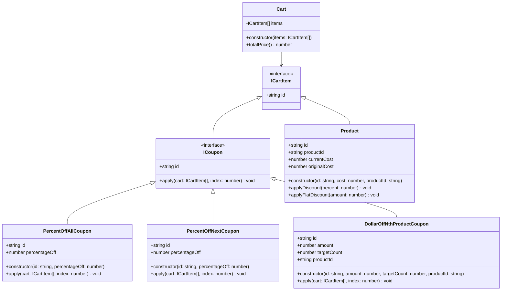
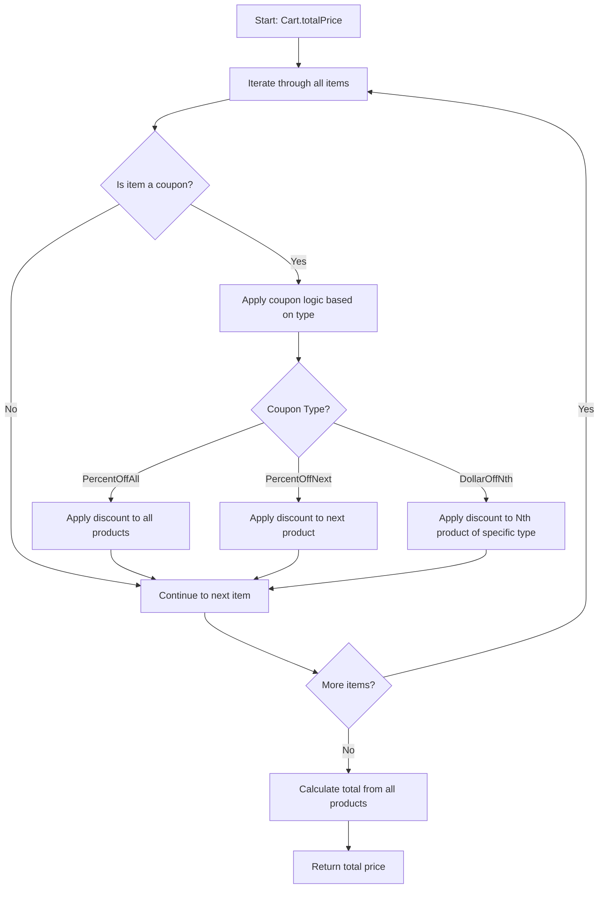
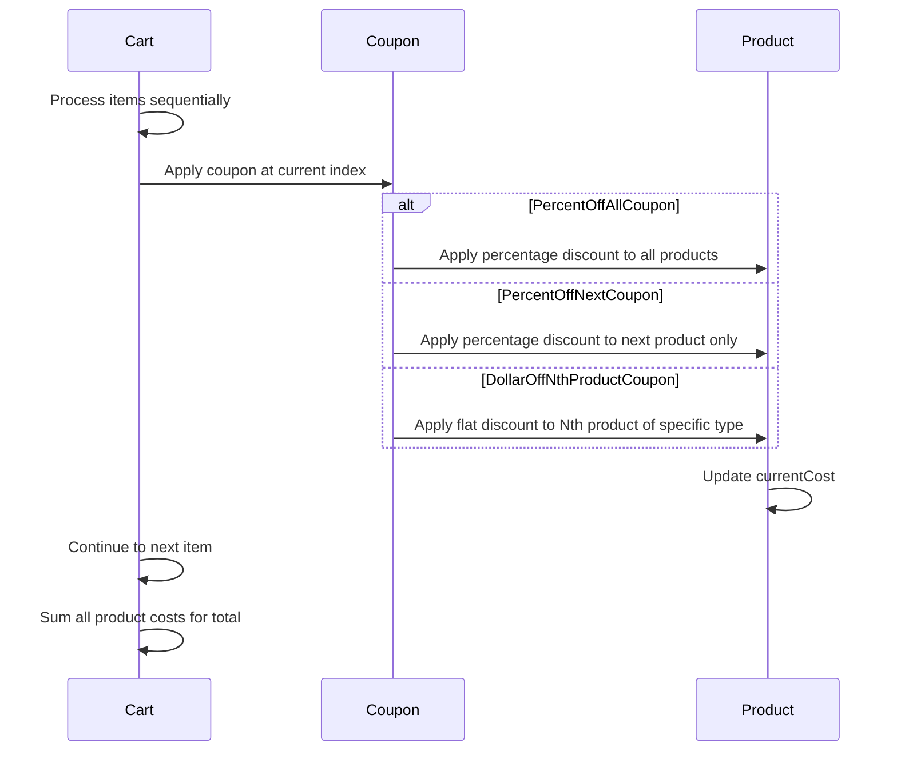

# Shopping Cart with Coupons - Solution

## Problem Overview
This solution implements a shopping cart system that can handle different types of coupons that affect the total price calculation. The system processes items and coupons in sequence.

## Solution Approach

The solution uses object-oriented design with interfaces and polymorphism to handle different types of coupons:

1. **Interface Segregation**: Separate interfaces for cart items and coupons
2. **Strategy Pattern**: Different coupon types implement the same interface but with different discount logic
3. **Sequential Processing**: Items and coupons are processed in the order they appear in the cart

## Architecture Diagram

## Algorithm Flow

## Coupon Processing Logic

## Key Components

### 1. Interfaces
- **ICartItem**: Base interface for all cart items (products and coupons)
- **ICoupon**: Interface defining the contract for all coupon types

### 2. Product Class
- Maintains original and current cost
- Supports both percentage and flat discounts
- Identified by product type for targeted coupons

### 3. Coupon Types
- **PercentOffAllCoupon**: Applies percentage discount to all products
- **PercentOffNextCoupon**: Applies percentage discount to the next product in sequence
- **DollarOffNthProductCoupon**: Applies flat discount to the Nth occurrence of a specific product type

### 4. Cart Class
- Processes items sequentially
- Applies coupons as they are encountered
- Calculates final total from product costs

## Time Complexity
- **O(n²)** in worst case where each coupon needs to scan remaining items
- **O(n)** space complexity for storing cart items

## Implementation Notes
The solution includes all necessary components:
1. **ICoupon interface**: Properly extends ICartItem and defines the apply method contract
2. **applyFlatDiscount method**: Implemented in Product class with proper bounds checking (Math.max(0, ...))
3. **Complete type safety**: All interfaces and implementations are fully defined

The code is production-ready and handles edge cases appropriately.
