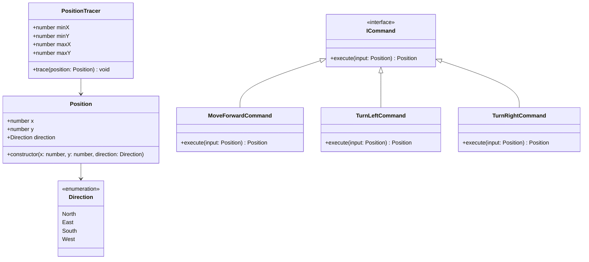
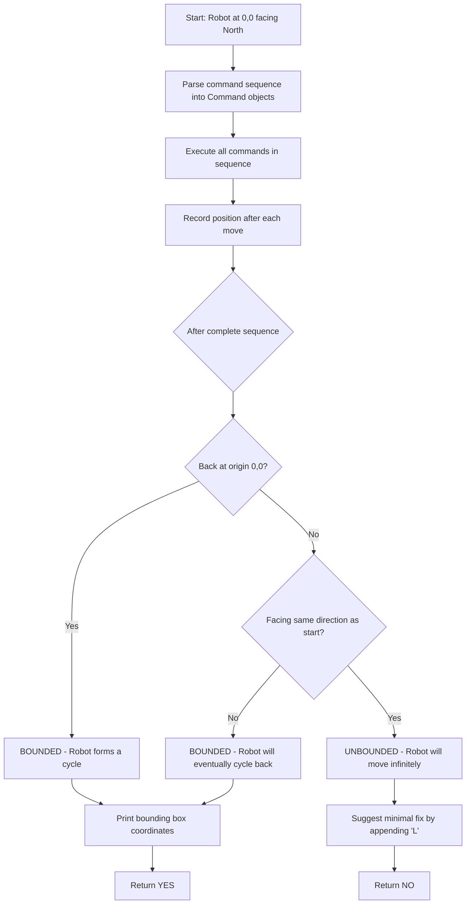
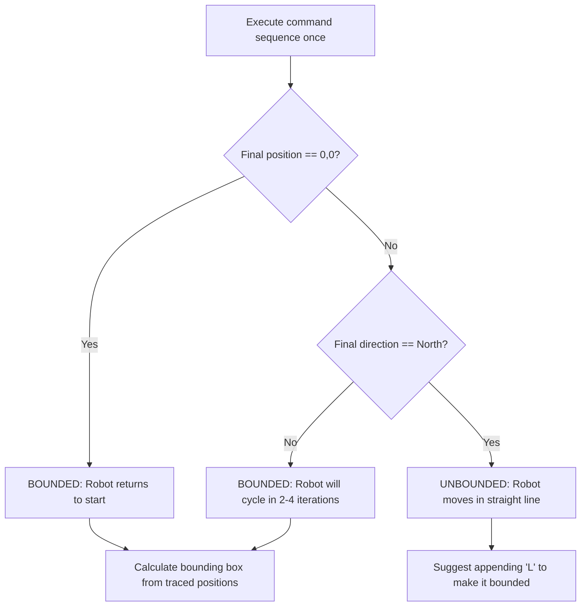
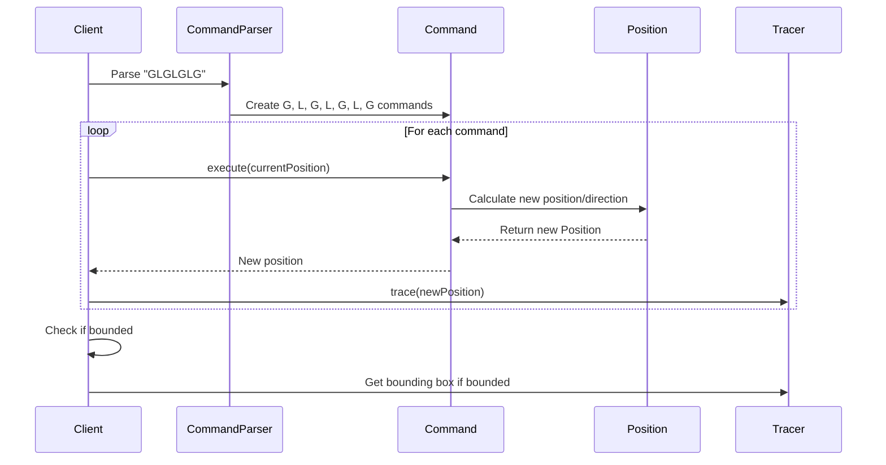

# Robot Bounded Movement Checker - Solution

## Problem Overview
Determine whether a robot executing a sequence of commands (G=move forward, L=turn left, R=turn right) in an infinite loop will stay within a bounded area or move infinitely in one direction.

## Solution Approach

The solution uses the **Command Pattern** and mathematical analysis to determine if a robot's movement is bounded:

1. **Command Pattern**: Each instruction (G, L, R) is implemented as a separate command class
2. **State Tracking**: Track robot position and direction after one complete sequence
3. **Boundedness Logic**: A robot is bounded if either:
   - It returns to origin (0,0) after one cycle, OR
   - It doesn't face the same direction as it started (will eventually form a cycle)

## Architecture Diagram

## Algorithm Flow

## Boundedness Logic

## Command Pattern Implementation

## Implementation Improvements

The current solution includes these enhancements:
- **Direction-aware movement**: MoveForwardCommand uses a switch statement to handle all four cardinal directions properly
- **Coordinate precision**: Each direction explicitly updates the correct coordinate (North/South affect y-axis, East/West affect x-axis)
- **Error handling**: Invalid directions throw descriptive errors for better debugging

## Key Components

### 1. Command Pattern Classes
- **ICommand**: Interface defining execute method
- **MoveForwardCommand**: Moves robot forward one step in current direction (North: y+1, South: y-1, East: x+1, West: x-1)
- **TurnLeftCommand**: Rotates robot 90° counterclockwise
- **TurnRightCommand**: Rotates robot 90° clockwise

### 2. Position Management
- **Position**: Immutable class storing x, y coordinates and direction
- **Direction**: Enum for the four cardinal directions

### 3. Tracing and Analysis
- **PositionTracer**: Tracks min/max x,y coordinates for bounding box calculation
- **Boundedness Logic**: Mathematical analysis based on final position and direction

## Mathematical Insight

The key insight is that after executing the command sequence once:

1. **If robot returns to 0,0**: It's definitely bounded (forms immediate cycle)
2. **If robot is at different position but facing different direction**: 
   - Robot will eventually return to origin in 2-4 complete cycles
   - This is because the robot will trace a closed geometric shape
3. **If robot is at different position AND facing same direction (North)**:
   - Robot will continue moving infinitely in the same pattern
   - Each cycle moves it further from origin

## Time & Space Complexity
- **Time**: O(n) where n is length of command sequence
- **Space**: O(1) for position tracking, O(k) for command objects where k is number of unique commands

## Extensions Implemented
1. **Bounding Box Calculation**: Shows the rectangular area the robot moves within
2. **Unbounded Sequence Fix**: Suggests appending 'L' to make unbounded sequences bounded

## Example Results
- `"GLGLGLG"` → YES (returns to origin)
- `"GG"` → NO (moves infinitely north, suggest append 'L')
- `"GGLLGG"` → YES (doesn't return to origin but changes direction)
