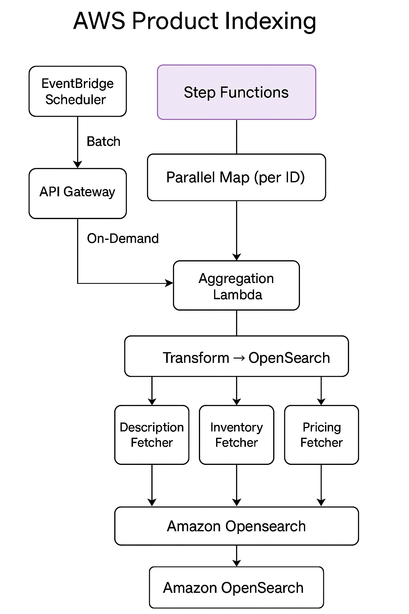

### Problem 6 (HLD):

* We want to build a product catalog for our ecommerce platform to enable our customers to easily find products based on different criteria. We need to fetch the product data from different services on the platform. For example, the product description, variants, availability, pricing, URL, images, etc. Each of these services is owned by a different team and some may scale better than others. You may assume that there is another service (a product store) that is a black box, where you store the data which provide an interface for searching the products using free text search.

    * Design a system to gather product data for different products and to make them indexable.
    * We need to be able to index all products as a batch.
    * We need to be able to index a specific product on demand.
    * We need to be able to delete a product.

* Questions:
    * To start the interview the candidate will need to figure out what product data is needed and what dependencies provide that data. Here the interviewer can push the candidate to continue exploring possible dependencies if the candidate is stuck. For example, merchandising data (text, product name), pricing, product attributes/variants, product availability, stock info, etc. See 
    https://vistaprint.atlassian.net/wiki/spaces/LAT/pages/405438716/Dependencies for examples.

    * How often can we run this (how many times a day) if we have 100 products? What about 1000 products? Or 10000? What does this mean for the requirements on the scalability of the underlying dependencies?

    * The candidate should estimate the response time for each dependency, and based on the number of dependencies and the number of products, figure out how long it takes to index all products, and from that, how often it can run.

    * Another good question to ask is “how often does it make sense to index all products?” Ask the candidate to think about how often the data changes. Does some data change more often? What do we do if we need to have more up to date stock information compared to merchandising data? Does the candidates design force a full reindex of all data if we only want to update one part of it? How can the candidate adapt their design to enable the system to index some data more frequently?

    * How can we scale this to a larger number of products? How can we make this an event driven architecture?

Here is the **copiable Markdown** version of the **Product Catalog Indexing System HLD with AWS services**, including the architecture diagram reference:

---

```md
# 🛒 Product Catalog Indexing System – HLD (AWS-Based)

## 🎯 Objective

Design a scalable system to:
- Index product data from multiple microservices.
- Support:
  - ✅ Batch indexing (all products).
  - 🔍 On-demand indexing (by product ID).
  - ❌ Deletion from index.

The system should be resilient, scalable, and cloud-native.

---

## 🧱 Key Components & AWS Service Mapping

| Logical Component       | AWS Services                                      |
|-------------------------|---------------------------------------------------|
| **API Entry Point**     | Amazon API Gateway + AWS Lambda                  |
| **Batch Scheduler**     | Amazon EventBridge (cron-based triggers)         |
| **Workflow Orchestrator**| AWS Step Functions                               |
| **Data Fetchers**       | AWS Lambda or AWS App Runner (microservices)     |
| **Data Aggregator**     | Lambda (merges multi-source data)                |
| **Transformer**         | Lambda (formats document for indexing)           |
| **Product Store**       | Amazon OpenSearch Service                        |
| **Product Source DB**   | DynamoDB / Aurora / S3 for product ID reference  |

---

## 🗺️ Architecture Diagram





---

## 🔄 Flow Summary

### 1. 🔁 **Batch Indexing**
- Triggered via EventBridge.
- Step Function:
  - Fetches product IDs.
  - For each ID, triggers parallel fetchers.
  - Aggregates & transforms.
  - Indexes to OpenSearch.

### 2. 🧠 **On-Demand Indexing**
- API Gateway → Lambda → Step Function.
- Same steps as batch, but for one product.

### 3. ❌ **Delete Product**
- API triggers Lambda.
- Lambda calls OpenSearch `DELETE` endpoint with `productId`.

---

## 🧩 AWS Service Roles

| Component           | Description |
|---------------------|-------------|
| **Step Functions**  | Workflow engine for coordinating service fetch, transform, and indexing. |
| **Lambdas**         | Stateless units for fetching data, aggregation, transformation. |
| **OpenSearch**      | Full-text indexing and querying engine. |
| **API Gateway**     | Trigger for external HTTP calls. |
| **EventBridge**     | Schedules batch jobs using cron rules. |

---

## 🔐 Resilience & Monitoring

| Concern                      | Solution                                   |
|-----------------------------|--------------------------------------------|
| Partial failures            | Timeouts, retries, circuit breakers on Lambda. |
| High fetch latency          | Parallel execution in Step Functions.      |
| Fault isolation             | Independent Lambda functions per fetcher.  |
| Monitoring                  | CloudWatch Logs, Metrics, and Alarms.      |

---

## 📦 Scalability

- **Fan-out per product** using Step Function map state.
- **Auto-scaled Lambdas** for individual fetch operations.
- **OpenSearch sharding** for high-throughput search indexing.

---

## 🛠️ Extensibility

| Extension                          | How to Implement                     |
|------------------------------------|--------------------------------------|
| Add new product metadata service   | Create new Lambda fetcher + plug in  |
| Support partial update             | Allow field-specific updates in index|
| Multi-region support               | Deploy orchestrators in each region  |

---

## 🧠 Sample Interview Summary

> "We chose AWS Step Functions for workflow orchestration, allowing us to run service fetches in parallel with fault tolerance and retry logic. Lambdas ensure each fetcher scales independently. The final transformed data is pushed into OpenSearch for full-text indexing. We support batch via EventBridge and on-demand via API Gateway, making the solution flexible and scalable."

---

# 🎤 Product Catalog Indexing – Follow-up Interview Questions & Suggested Responses

---

## 🔍 1. What data do we need and what services provide it?

> "To build a comprehensive, searchable product catalog, we need to aggregate data from multiple domain services, each owned by different teams."

| Data Type                    | Dependency Service Name (Example)       |
|-----------------------------|-----------------------------------------|
| Product Name & Description  | Merchandising / Content Service         |
| Pricing & Currency Info     | Pricing Service                         |
| Product Variants/Attributes | Variant Service                         |
| Stock & Availability        | Inventory Service                       |
| Images                      | Media Service                           |
| SEO-Friendly URL            | URL Mapping Service                     |
| Categories/Tags             | Taxonomy/Classification Service         |
| Localization                | Localization/Translation Service        |

> "We should design the system to easily plug in more fetchers as new dependencies emerge."

---

## 🧮 2. How often can we run this for 100/1000/10000 products?

Let’s estimate:

- Assume:
  - ~6 dependencies per product.
  - Each dependency API call = 200ms avg.
  - Network + overhead = 300ms per dependency.
  - Total = ~1.8s per product (parallel fetch).

| Product Count | Total Time (Sequential) | Time with Parallelism (10 workers) |
|---------------|-------------------------|-------------------------------------|
| 100 products  | ~180s (~3 mins)         | ~18s                                |
| 1,000         | ~30 mins                | ~3 mins                             |
| 10,000        | ~5 hours                | ~30 mins                            |

> "Using AWS Step Function's Map state with parallelism and rate limiting, we can scale this to index thousands of products within minutes."

---

## 🧠 3. How often should we index all products?

- **Full reindexing** is useful:
  - Daily or weekly (for static info like names, images).
  - After large product imports or merchandising changes.

- **Incremental/indexing-by-type**:
  - Stock/price changes may occur hourly or even more frequently.
  - Variants may change only when the product is updated.

> "Our design can be extended to fetch only certain types of data per run, enabling more frequent indexing of dynamic data (e.g., stock, price)."

---

## 🔄 4. Does our design force full reindexing?

> "No, we can modularize data fetchers so that only a subset of services are called depending on what’s needed."

**Improvement:**
- Add a `DataType` param in the orchestrator to select:
  - `full` → fetch all data
  - `stockOnly` → only fetch from Inventory
  - `priceOnly` → only fetch from Pricing

This minimizes load on services and enables real-time indexing for fast-changing data.

---

## ⚙️ 5. How can we scale this to support more products?

> "Our design is horizontally scalable using AWS."

| Aspect           | Scaling Strategy                                  |
|------------------|----------------------------------------------------|
| Fetchers         | Lambda concurrency, App Runner autoscaling         |
| Workflow Engine  | Step Functions Map state with concurrency control  |
| Storage          | OpenSearch auto-sharding & index rollover         |
| Load isolation   | Add queues (SQS) between orchestrator and workers |

Also:
- Use **batch processing** for bulk indexing.
- Use **chunked parallel fetch** (e.g., 500 products at a time).

---

## 📣 6. Can we make this event-driven?

> "Yes, we can trigger partial indexing flows based on events like product updates or stock changes."

| Trigger Source              | Event Format                     | Action Taken                           |
|-----------------------------|----------------------------------|----------------------------------------|
| Inventory Service → SNS     | `{ productId, change: 'stock' }`| Trigger Step Function for stock fetch  |
| Pricing Service → SNS       | `{ productId, change: 'price' }`| Trigger pricing-only fetch             |
| CMS Update → SNS/SQS        | `{ productId, change: 'content'}`| Trigger merchandising update           |

**Tools:**
- Use Amazon **SNS → SQS + Lambda**
- Use **EventBridge Pipes** to control routing to Step Functions

---

## ✅ Summary

> “To handle change frequency variation and scalability, we use a modular, event-driven architecture. We separate fetchers by domain and allow both full and partial reindexing. This makes the system fast, fault-tolerant, and cost-efficient.”

---


