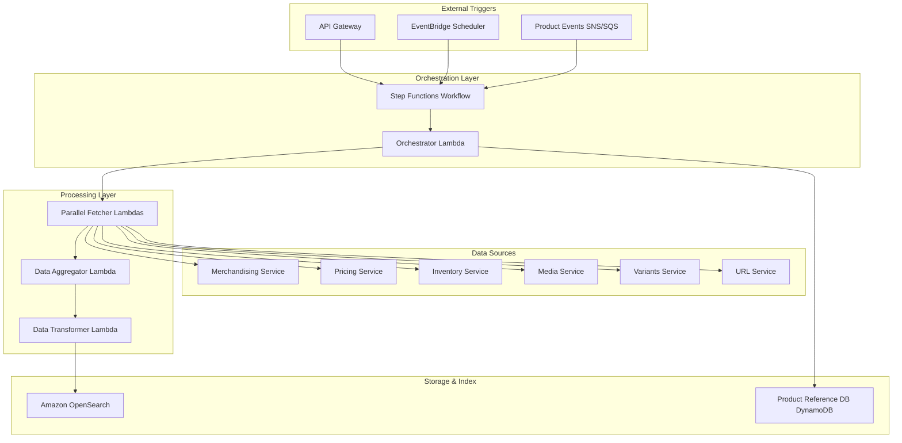
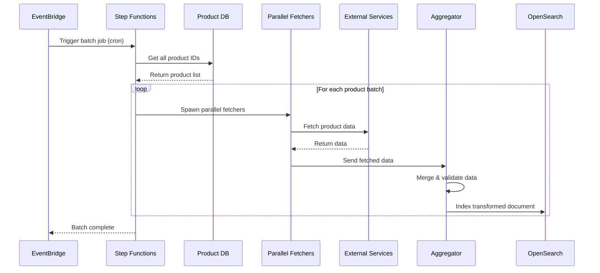
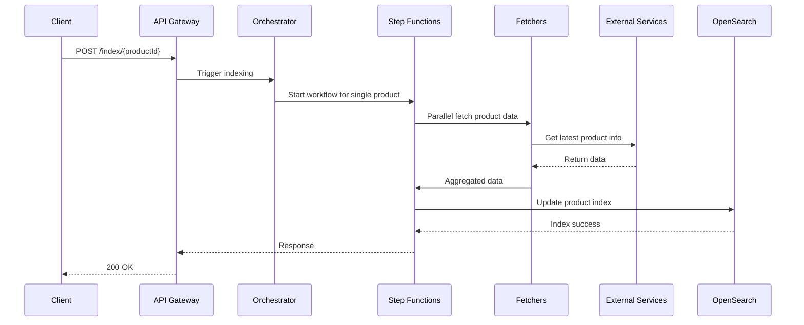
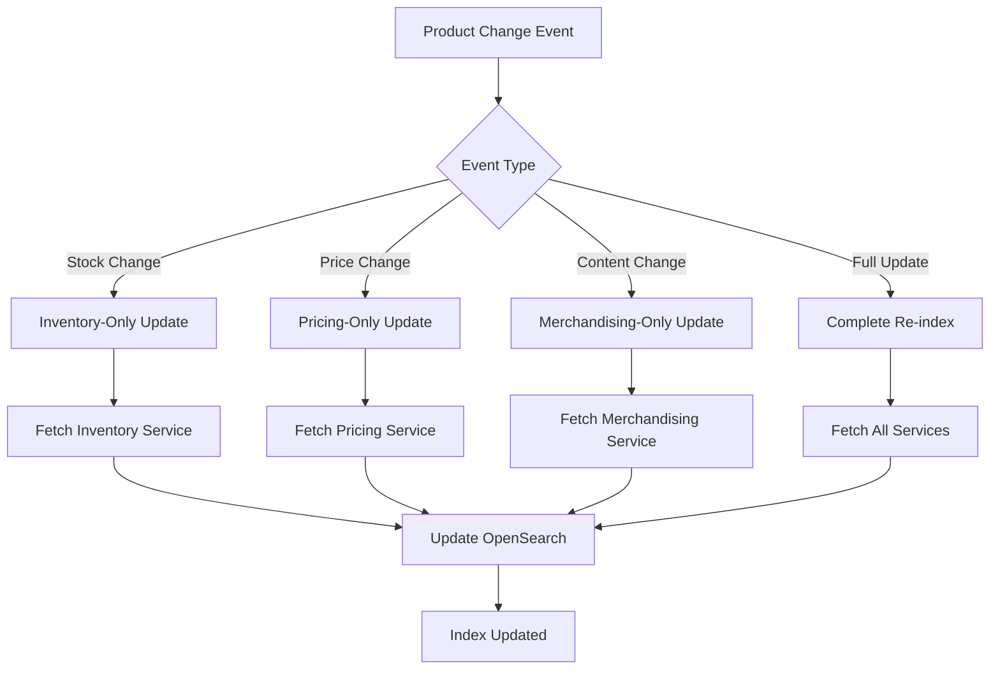
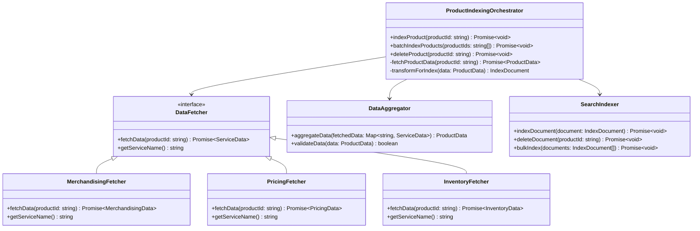
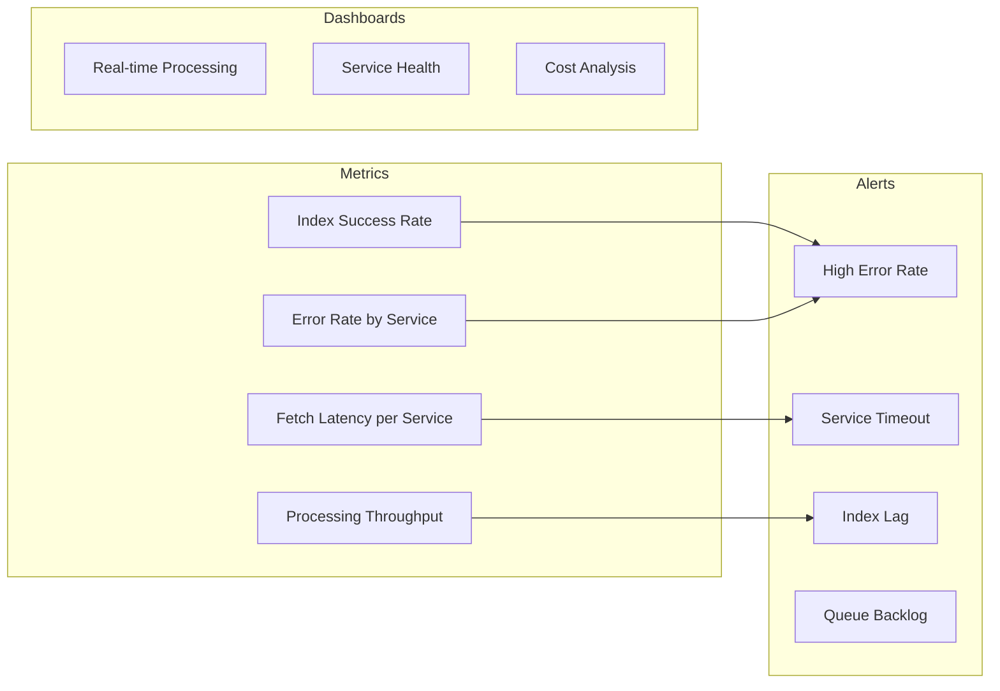

# Product Catalog Indexing System - HLD Solution

## Problem Overview
Design a scalable product catalog indexing system that can aggregate product data from multiple microservices and make them searchable. The system must support batch indexing, on-demand indexing, and product deletion.

## Solution Approach

This high-level design uses **microservices architecture** with **event-driven patterns** and **cloud-native AWS services** to create a scalable, resilient product indexing system.

### Key Requirements
- Fetch product data from multiple services (pricing, inventory, content, etc.)
- Support batch indexing of all products
- Support on-demand indexing of specific products
- Support product deletion from index
- Handle different scaling characteristics of various services

## High-Level Architecture



## System Flow Diagrams

### Batch Indexing Flow


### On-Demand Indexing Flow


### Event-Driven Updates


## Service Architecture Components



## Key Design Decisions

### 1. **Microservices Integration**
- **Pattern**: Service Aggregation Pattern
- **Benefit**: Isolates failures, allows independent scaling
- **Implementation**: Parallel fetchers with circuit breakers

### 2. **Event-Driven Architecture**
- **Pattern**: Event Sourcing + CQRS
- **Benefit**: Real-time updates, reduced full reindexing
- **Implementation**: SNS/SQS for product change events

### 3. **Orchestration Strategy**
- **Pattern**: Workflow Orchestration (Step Functions)
- **Benefit**: Visual workflow, built-in error handling, state management
- **Implementation**: Map states for parallel processing

### 4. **Data Consistency**
- **Pattern**: Eventually Consistent
- **Benefit**: High availability, partition tolerance
- **Trade-off**: Some data may be briefly stale

## Scalability Analysis

### Performance Estimates
| Products | Sequential Time | Parallel Time (10 workers) | Frequency |
|----------|-----------------|----------------------------|-----------|
| 100      | ~3 minutes      | ~18 seconds               | Every 15 min |
| 1,000    | ~30 minutes     | ~3 minutes                | Hourly |
| 10,000   | ~5 hours        | ~30 minutes               | Daily |
| 100,000  | ~50 hours       | ~5 hours                  | Weekly |

### Scaling Strategies
1. **Horizontal Scaling**: Auto-scaling Lambda functions
2. **Batching**: Process products in configurable batch sizes
3. **Rate Limiting**: Protect downstream services from overload
4. **Caching**: Cache frequently accessed product reference data
5. **Sharding**: Partition products by category or region

## Monitoring & Observability



## Extension Points

### 1. **Partial Indexing**
```typescript
enum IndexType {
    FULL = 'full',
    PRICING_ONLY = 'pricing',
    INVENTORY_ONLY = 'inventory',
    CONTENT_ONLY = 'content'
}
```

### 2. **Multi-Region Support**
- Deploy orchestrators in each region
- Cross-region replication of OpenSearch
- Regional service endpoints

### 3. **A/B Testing Support**
- Multiple index versions
- Traffic splitting for index validation
- Rollback capabilities

## Cost Optimization

1. **Spot Instances**: Use for batch processing workflows
2. **Reserved Capacity**: For predictable baseline load
3. **Intelligent Tiering**: Archive old product data
4. **Service Mesh**: Optimize inter-service communication

This design provides a robust, scalable solution that can handle varying loads while maintaining data consistency and system reliability.

