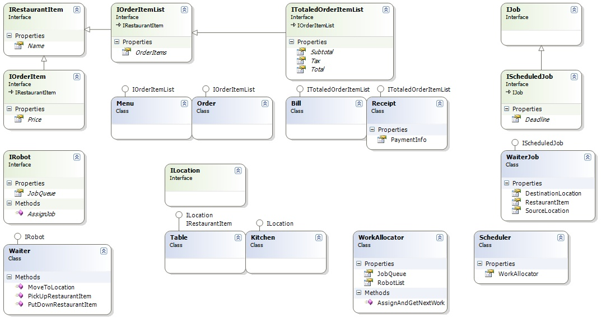

### Problem 3 (LLD):

An exclusive French restaurant in Boston has decided to replace its waitstaff with robots. They take orders, serve food, and do all the other things that waiters do. However, the restaurant does not want to compromise on quality. Robot waiters must run efficiently and achieve high customer satisfaction.

* Your job is to: 
    * Use good design principles to outline the major components and data involved.
    * If doing object-oriented design, this is usually going to be a class diagram of some kind.
    * If doing service-oriented design, this will usually be a set of self-contained services with API routes.
    * Run through some use cases, producing specific traces using the exact entities defined in #1, not just hand-waving.

**Note:** 
    You do not have to model the kitchen, which is provided by a third party. 
    It supports the basic interface 
        Kitchen.Make(...) (asynchronous), 
        Kitchen.IsReady(...) and 
        Kitchen.Get(...). 
    The third party is happy to set the method or service parameters to match whatever you design

```

Kitchen methods (third-party)

Kitchen.Make(…)  Make something

Kitchen.IsReady(…)  Is something ready?

Kitchen.Get(…)  Retrieve something

```

**Use case #1**

A customer selects an item from the menu. A waiter delivers the order to the kitchen. Time passes. The meal is ready. A waiter delivers it to the customer's table.

Your method trace must look like


Caller                 |         Method Called
-----------------------|--------------------------------
Caller’s class name    |         ClassName.MethodName()
Caller’s class name    |         ClassName.MethodName()
…etc…                  |         …etc…

**Use Case #2**

Same as Use Case #1, but…

As the waiter is delivering the order to the kitchen, a customer at another table says “excuse me” and asks for a glass of water. Another customer at another table adds, “Oh, I'd like a glass of water too.”

#### Solution:



There are many approaches to this problem. This is just one.

An interface `IRestaurantItem` is for any object in the restaurant that can be manipulated (say, carried by a waiter), such as a food item, a table, a menu, or an order.

We get commonality between menus, orders, bills, and receipts as lists of priced order items, some with totals.

Jobs for waiters and chefs are different, but they're all jobs and therefore can all be queued as work in a WorkAllocator. The master Scheduler receives all requests and assigns all work.

*Different candidates, however, might focus on very different things. The most important goal is to judge their OOD or general Design skills, not for them to come up with a particular set of classes. Give the candidate some flexibility in solving the problem, but only if their chosen direction lets you fairly judge their skills.*
