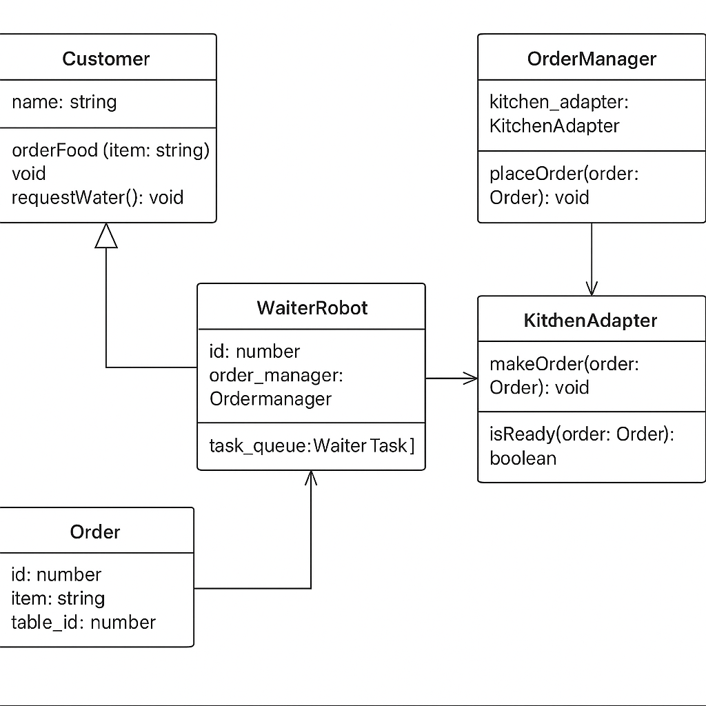

### Problem 3 (LLD):

An exclusive French restaurant in Boston has decided to replace its waitstaff with robots. They take orders, serve food, and do all the other things that waiters do. However, the restaurant does not want to compromise on quality. Robot waiters must run efficiently and achieve high customer satisfaction.

* Your job is to: 
    * Use good design principles to outline the major components and data involved.
    * If doing object-oriented design, this is usually going to be a class diagram of some kind.
    * If doing service-oriented design, this will usually be a set of self-contained services with API routes.
    * Run through some use cases, producing specific traces using the exact entities defined in #1, not just hand-waving.

**Note:** 
    You do not have to model the kitchen, which is provided by a third party. 
    It supports the basic interface 
        Kitchen.Make(...) (asynchronous), 
        Kitchen.IsReady(...) and 
        Kitchen.Get(...). 
    The third party is happy to set the method or service parameters to match whatever you design

```

Kitchen methods (third-party)

Kitchen.Make(…)  Make something

Kitchen.IsReady(…)  Is something ready?

Kitchen.Get(…)  Retrieve something

```

**Use case #1**

A customer selects an item from the menu. A waiter delivers the order to the kitchen. Time passes. The meal is ready. A waiter delivers it to the customer's table.

Your method trace must look like


Caller                 |         Method Called
-----------------------|--------------------------------
Caller’s class name    |         ClassName.MethodName()
Caller’s class name    |         ClassName.MethodName()
…etc…                  |         …etc…

**Use Case #2**

Same as Use Case #1, but…

As the waiter is delivering the order to the kitchen, a customer at another table says “excuse me” and asks for a glass of water. Another customer at another table adds, “Oh, I'd like a glass of water too.”

#### Solution:




Here's the complete **Markdown explanation** of your solution that you can copy and paste to share with your interviewer:

---

# 🤖 Robot Waitstaff System – Low-Level Design Explanation

## ✅ High-Level Summary

I designed a scalable, event-driven system to replace human waitstaff with robots in a restaurant. The goal was to handle **food orders**, **delivery**, and **on-demand requests (like water)** while maintaining **high efficiency** and **customer satisfaction**.

---

## 🧱 Key Components

| Component        | Role                                                              |
| ---------------- | ----------------------------------------------------------------- |
| `Customer`       | Requests food or water. Interacts with waiter and order manager.  |
| `WaiterRobot`    | Maintains a task queue. Delivers food or fulfills water requests. |
| `OrderManager`   | Central async order tracker. Emits events when food is ready.     |
| `KitchenAdapter` | Connects to third-party `Kitchen` interface.                      |
| `Restaurant`     | Manages setup: tables, customers, and waiters.                    |

---

## 🔄 Flow for Food Order and Water Request

### 📌 Use Case 1: Customer Orders Food

1. `Customer.orderFood(item)` creates an `Order`.
2. `OrderManager.placeOrder()` forwards it to `KitchenAdapter`.
3. `OrderManager` periodically checks if the kitchen marks the order ready.
4. When ready, `OrderManager` emits `orderReady`.
5. An available `WaiterRobot` picks the task from the event and delivers food.

### 📌 Use Case 2: Water Request

1. `Customer.requestWater()` calls `WaiterRobot.enqueueTask()`.
2. The waiter queues and fulfills the water request independently.

---

## ⚙️ Asynchronous & Event-Driven Behavior

* `OrderManager` uses `setInterval` to **poll asynchronously** for kitchen readiness.
* `WaiterRobot` has a **FIFO task queue**, allowing multitasking.
* **Delivery is out-of-order** — the system delivers food as soon as it’s ready, not as per request sequence.

---

## 📐 OOP & Design Principles Used

| Principle                 | Application                                                                |
| ------------------------- | -------------------------------------------------------------------------- |
| **Single Responsibility** | Each class has one focused job (e.g., `OrderManager` tracks orders only).  |
| **Observer Pattern**      | `EventEmitter` notifies waiters when orders are ready.                     |
| **Open/Closed**           | System supports new task types without changing existing logic.            |
| **Encapsulation**         | Each class manages its own logic cleanly and privately.                    |
| **Strategy-ready**        | `KitchenAdapter` wraps external interface, allowing testable abstractions. |

---

## 🚀 Scalability Strengths

* Add more waiters to handle load — the system remains responsive.
* Water requests don’t block food delivery thanks to independent task queues.
* Orders are processed based on readiness, not submission time — improving throughput.
* Easy to extend: priority queues, waiter load balancing, or smart table mapping.

---

## ✂️ Simplifications Made

> I started with more layers like `Dispatcher` and a separate `Task` class, but I removed them after realizing the `WaiterRobot` could manage task queuing itself. This reduced complexity while preserving modularity and extensibility.

---

## 🧪 Possible Extensions

* Add priorities to tasks (e.g., urgent delivery vs water).
* Improve kitchen integration to be fully async (replace polling with WebSocket events).
* Add a `Host` class to manage seating and waiters dynamically.
* Include retry logic or kitchen timeouts.

---
