# Robot Restaurant System - LLD Solution

## Problem Overview
Design a restaurant management system where robot waiters handle customer orders, interact with a third-party kitchen API, and ensure high customer satisfaction through efficient task management.

## Solution Approach

This solution implements an **event-driven architecture** with the **Observer Pattern** and **Command Pattern** to manage restaurant operations efficiently:

1. **Event-Driven Design**: Uses EventEmitter for asynchronous order notifications
2. **Observer Pattern**: OrderManager notifies WaiterRobots when orders are ready
3. **Command Pattern**: Tasks are queued and processed by robot waiters
4. **Adapter Pattern**: KitchenAdapter wraps the third-party Kitchen API

## Complete System Architecture

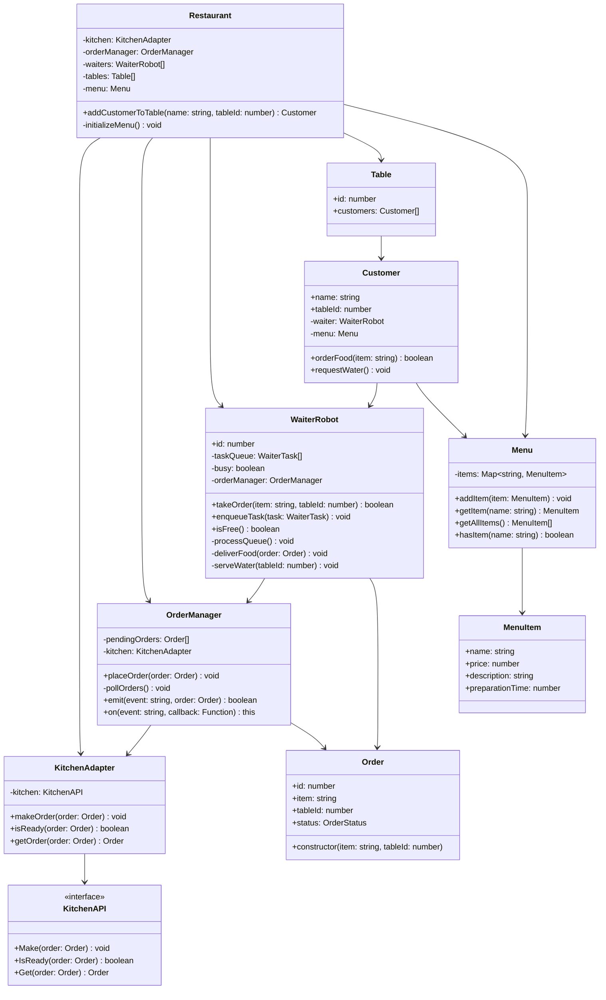

## Order Processing Flow

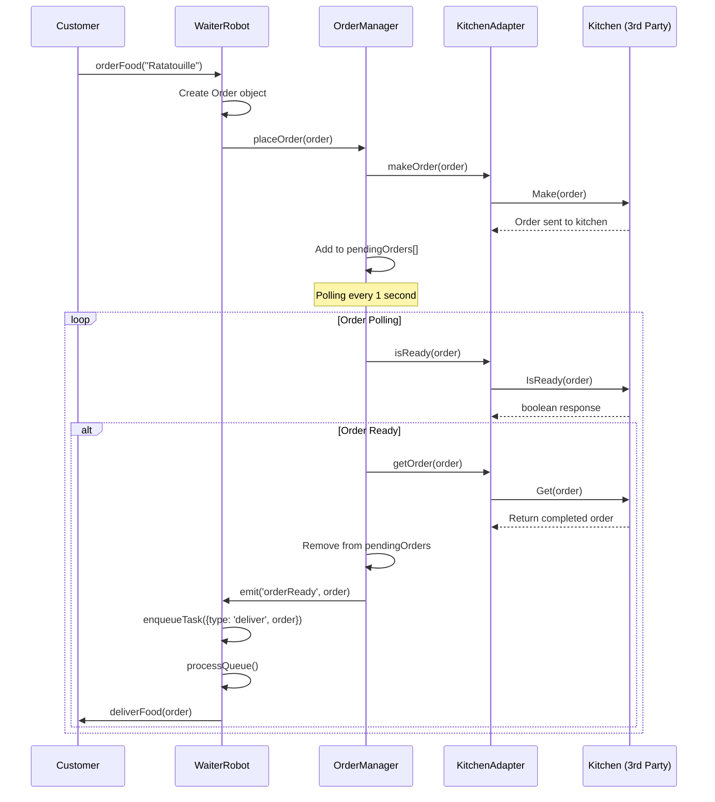

## Task Management System

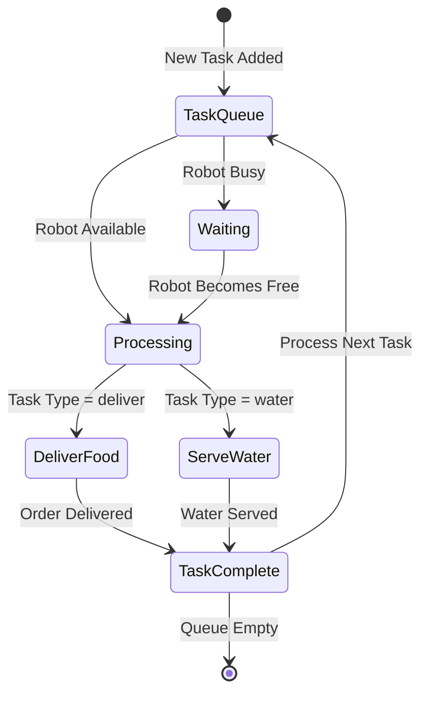

## Event-Driven Architecture Flow

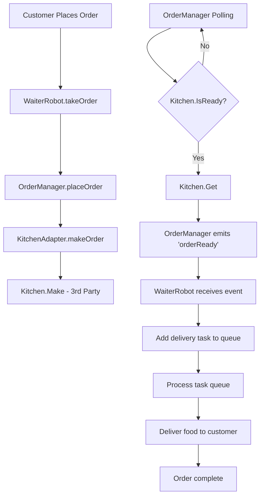

## Key Design Patterns

### 1. Observer Pattern
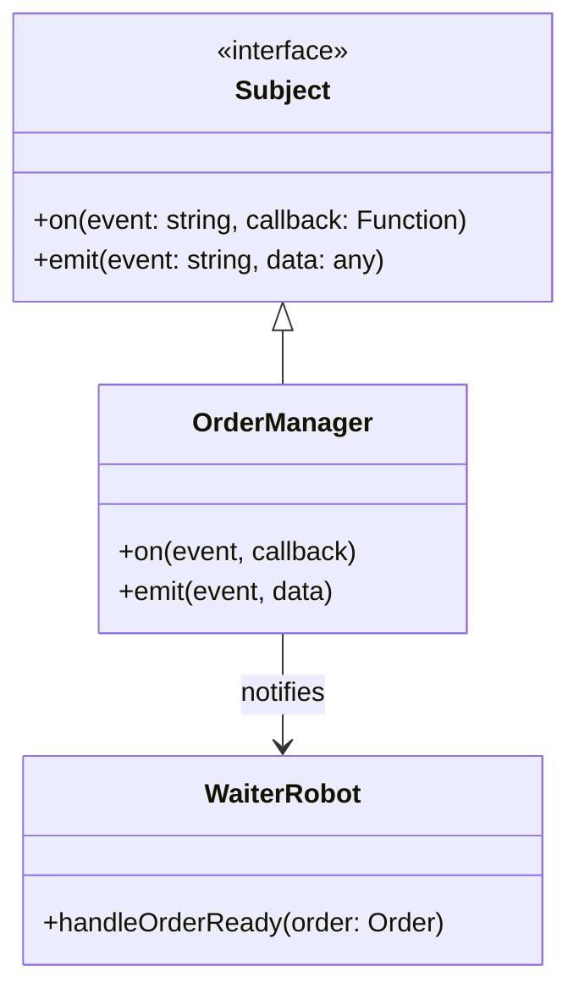

### 2. Adapter Pattern
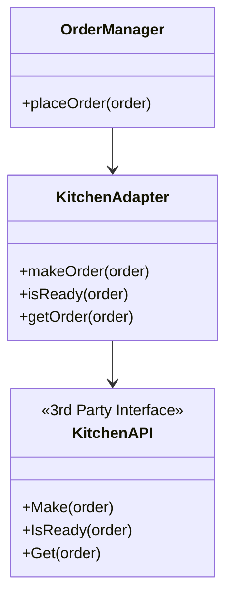

### 3. Command Pattern (Task Queue)
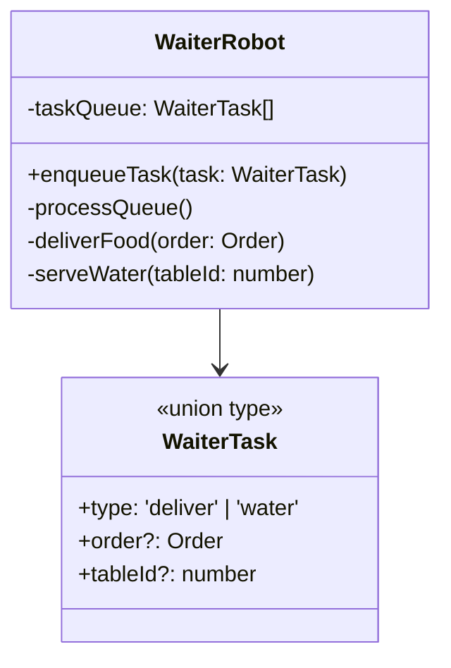

## System State Management

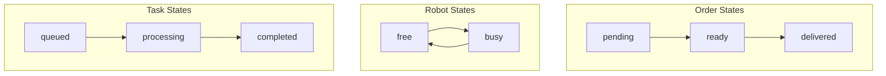

## Restaurant Workflow

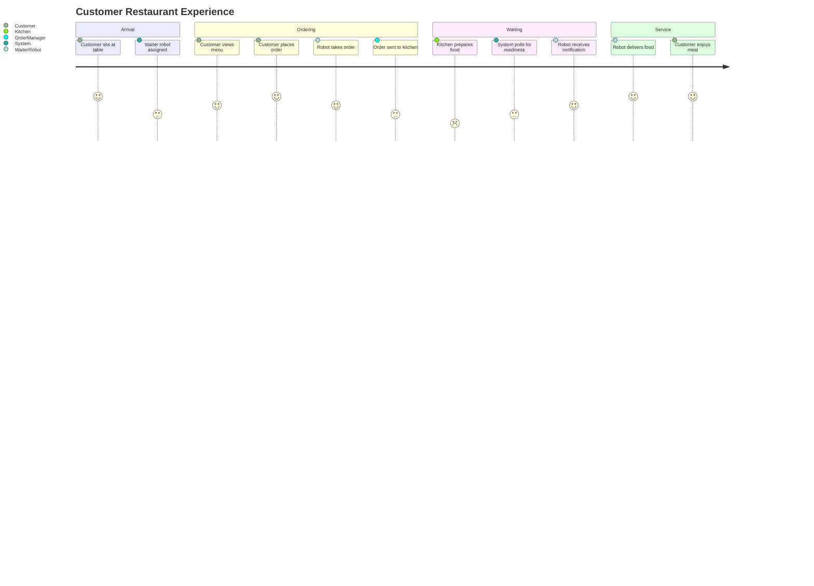

## Scalability Considerations

### Robot Pool Management
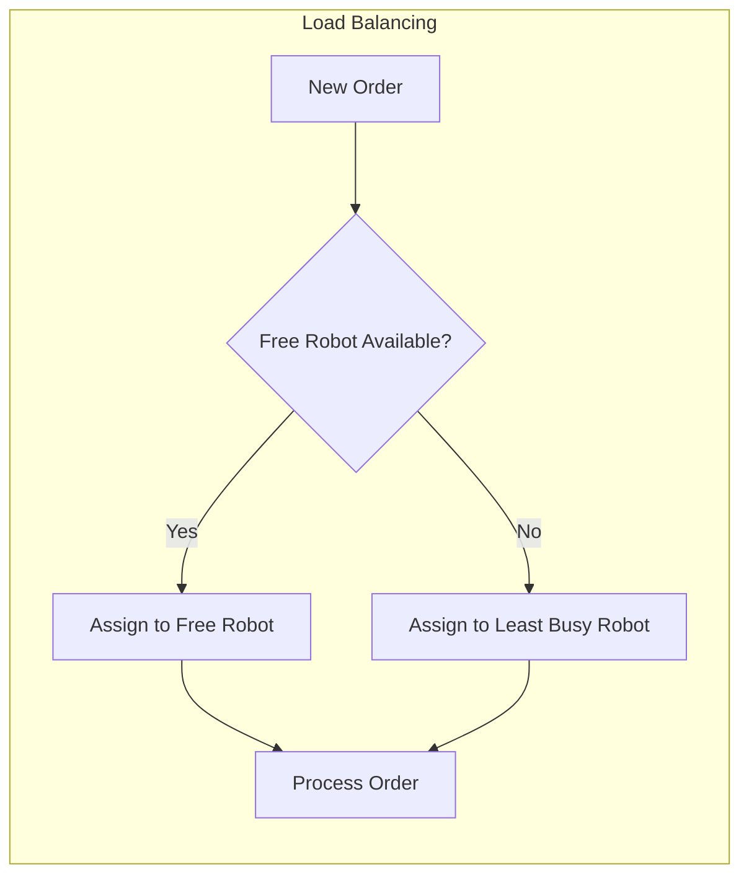

### Concurrent Order Processing
```mermaid
gantt
    title Robot Task Timeline
    dateFormat X
    axisFormat %L
    
    section Robot 1
    Take Order 1    :0, 1
    Deliver Order 1 :4, 5
    Serve Water     :6, 7
    
    section Robot 2
    Take Order 2    :1, 2
    Take Order 3    :2, 3
    Deliver Order 2 :5, 6
    Deliver Order 3 :7, 8
```

## Error Handling & Recovery

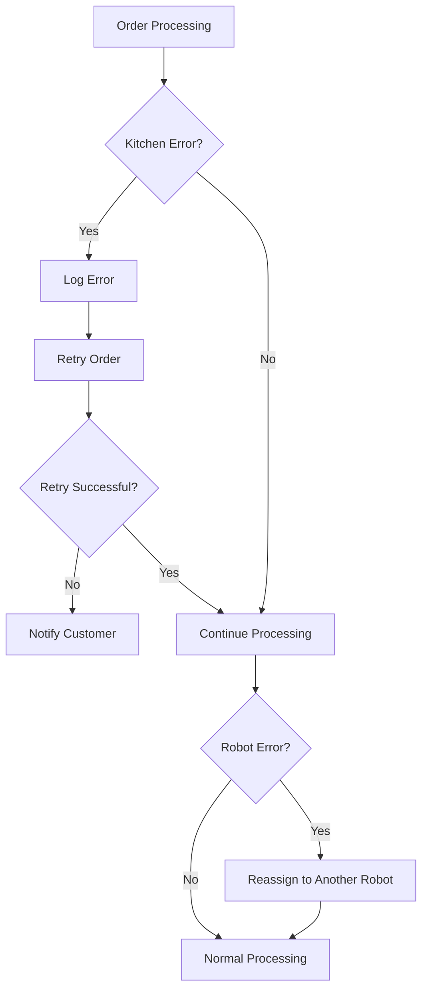

## Key Features

### 1. **Asynchronous Order Management**
- Non-blocking order processing
- Event-driven notifications
- Efficient polling of kitchen status

### 2. **Task Queue System**
- Prioritized task processing
- Robot availability tracking
- Concurrent task handling

### 3. **Flexible Menu System**
- Dynamic menu management
- Item validation
- Preparation time tracking

### 4. **Scalable Robot Pool**
- Multiple robot support
- Load distribution
- Fault tolerance

## Performance Characteristics

- **Order Processing**: O(1) for order placement
- **Task Queue**: O(n) for queue processing where n = number of tasks
- **Kitchen Polling**: O(m) where m = number of pending orders
- **Robot Assignment**: O(k) where k = number of robots

This design ensures efficient restaurant operations while maintaining high customer satisfaction through systematic task management and event-driven coordination.