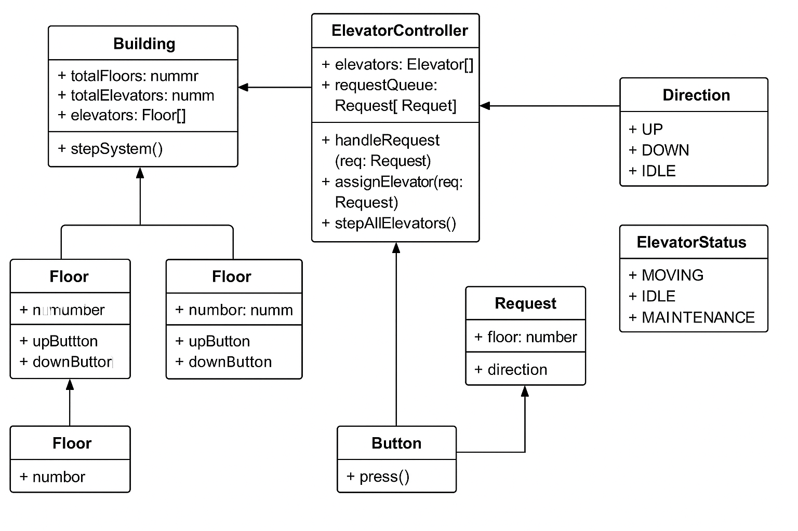

---

# 🚀 Elevator System – LLD Explanation

## ✅ Problem Statement

> Design a customizable, reusable elevator system that supports multiple buildings. Each building can have multiple elevators and floors.

---

## 🧱 Key Components

| Class                | Responsibility                                                         |
| -------------------- | ---------------------------------------------------------------------- |
| `Building`           | Represents a single building. Contains elevators and floors.           |
| `Elevator`           | Models the elevator itself – tracks floor, direction, queue.           |
| `Floor`              | Represents a single floor. Has up/down buttons.                        |
| `Button`             | When pressed, sends a request to the controller.                       |
| `Request`            | Encapsulates a request (floor + direction).                            |
| `ElevatorController` | Central dispatch brain – decides which elevator handles which request. |

---

## 📌 How It Works (Step-by-Step)

1. A `Floor` button is pressed → creates a `Request`.
2. `ElevatorController` assigns an elevator based on simple strategy:

   * Prefer idle elevator
   * Else, nearest elevator
3. Elevator adds the requested floor to its queue.
4. Each system `step()` moves elevators one floor toward their destination.

---

## ⚙️ Design Principles Used

| Principle                       | Application                                                     |
| ------------------------------- | --------------------------------------------------------------- |
| **SRP (Single Responsibility)** | Each class handles one thing: Elevator moves, Controller routes |
| **Open/Closed**                 | Easy to add VIP mode, weight limit, access control              |
| **Encapsulation**               | Elevator hides internal state like queue and direction          |
| **Strategy-ready**              | Dispatch logic can be extended without changing Elevator        |

---

## 🔁 Example Run

```ts
const building = new Building(10, 2);
building.floors[3].upButton.press();   // Request at floor 3 UP
building.floors[7].downButton.press(); // Request at floor 7 DOWN
```

> Then every second, elevators move one floor via:

```ts
setInterval(() => {
  building.stepSystem();
}, 1000);
```

---

## 🧱 Class Diagram (Text UML Format)



```
+------------------+
| Building         |
+------------------+
| totalFloors      |
| totalElevators   |
| elevators[]      |
| floors[]         |
| controller       |
+------------------+
| stepSystem()     |
+------------------+

+------------------+
| Elevator         |
+------------------+
| id               |
| currentFloor     |
| direction        |
| status           |
| stopsQueue[]     |
+------------------+
| addStop(floor)   |
| step()           |
| isIdle()         |
+------------------+

+----------------------+
| ElevatorController   |
+----------------------+
| elevators[]          |
| requestQueue[]       |
+----------------------+
| handleRequest(req)   |
| assignElevator(req)  |
| stepAllElevators()   |
+----------------------+

+------------------+
| Floor            |
+------------------+
| number           |
| upButton         |
| downButton       |
+------------------+

+------------------+
| Button           |
+------------------+
| press()          |
+------------------+

+------------------+
| Request          |
+------------------+
| floor            |
| direction        |
+------------------+

Enum Direction: UP, DOWN, IDLE  
Enum ElevatorStatus: MOVING, IDLE, MAINTENANCE
```
