# Elevator System - LLD Solution

## Problem Overview
Design a customizable, reusable elevator system that supports multiple buildings with multiple elevators and floors. The system should efficiently handle elevator requests and optimize elevator dispatching.

## Solution Approach

This solution implements a **comprehensive elevator control system** using several design patterns:

1. **State Machine Pattern**: Elevator status and direction management
2. **Command Pattern**: Button presses create requests
3. **Strategy Pattern**: Elevator assignment strategies
4. **Observer Pattern**: Request handling and notifications
5. **Singleton Pattern**: Central controller for the building

## Complete System Architecture

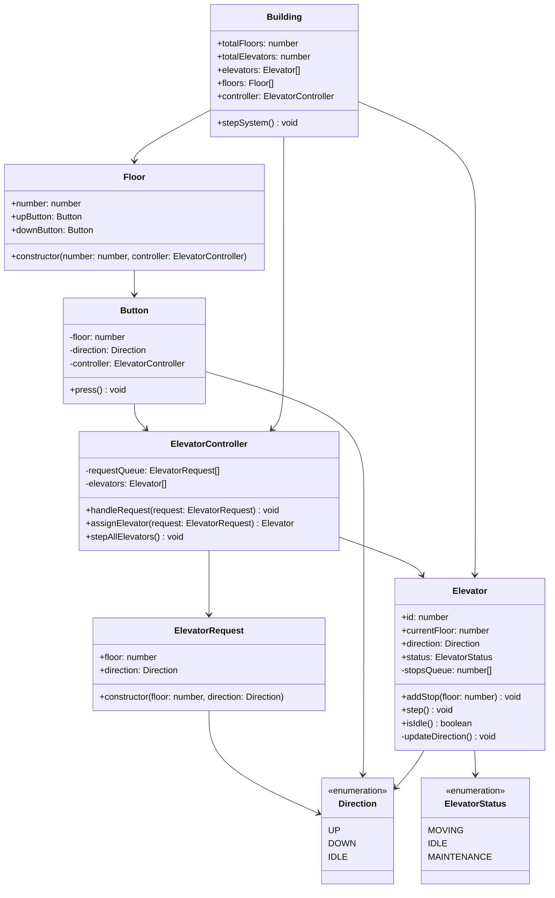

## Elevator State Machine

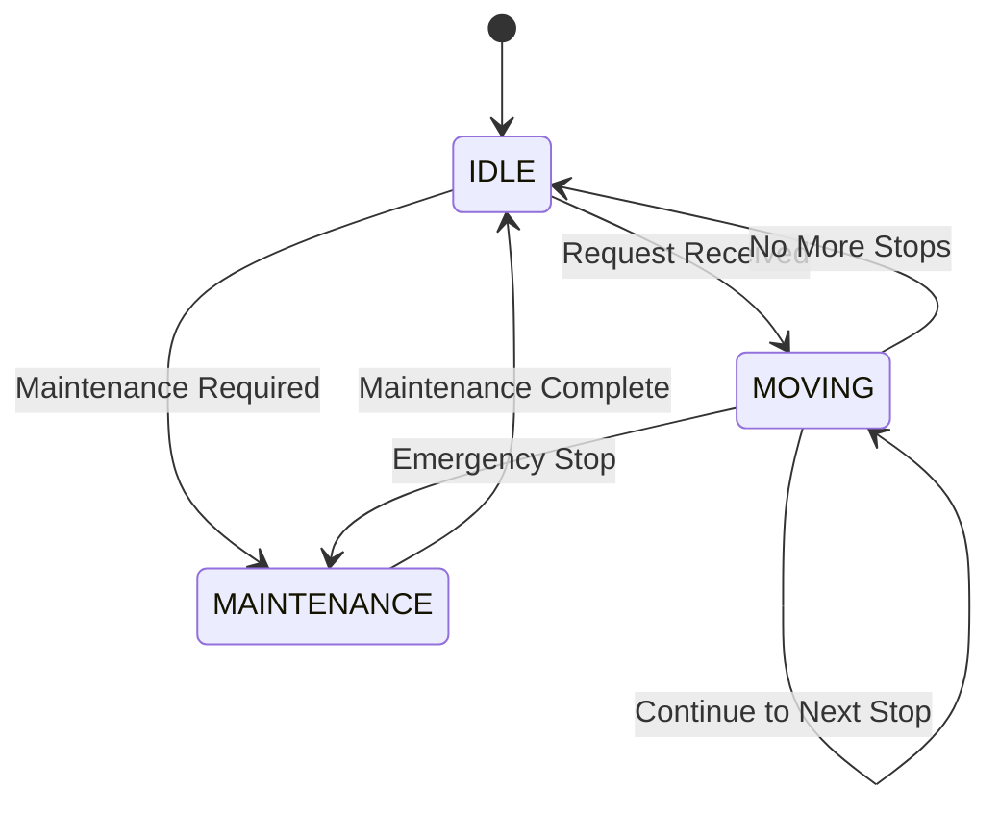

## Request Processing Flow

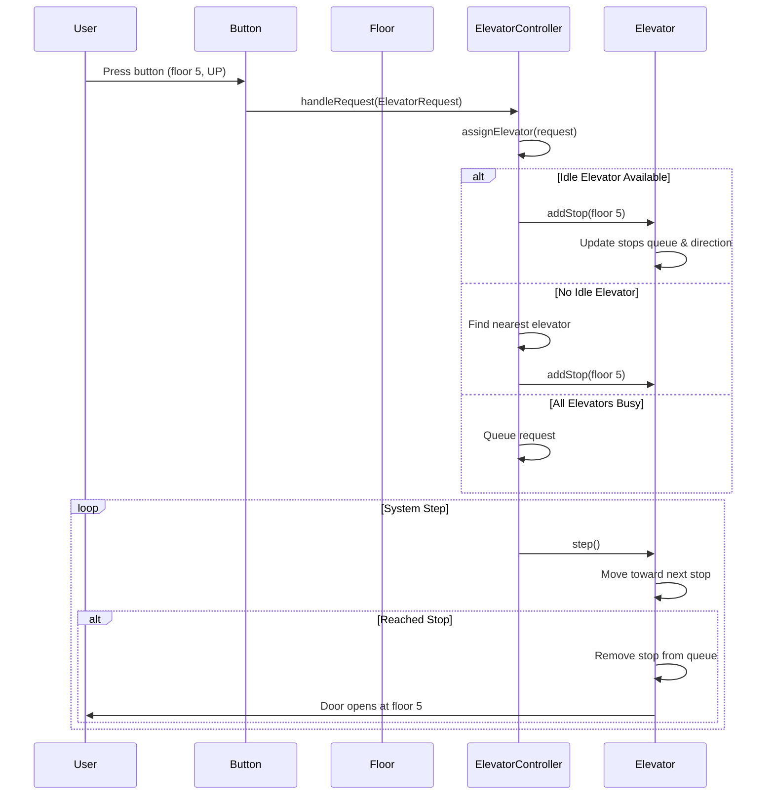

## Elevator Movement Algorithm

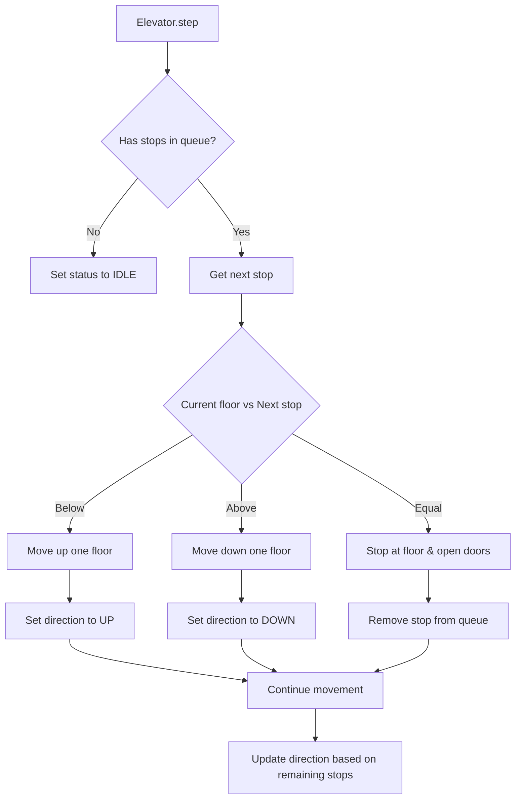

## Elevator Assignment Strategy

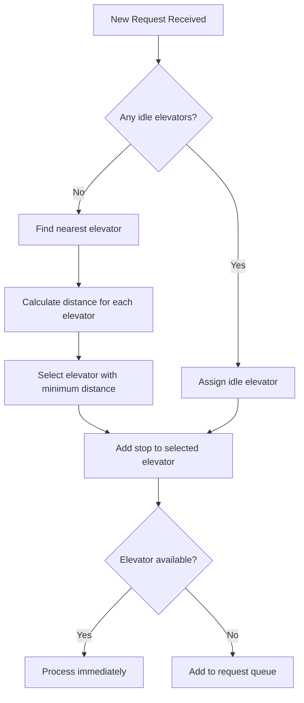

## Queue Management System

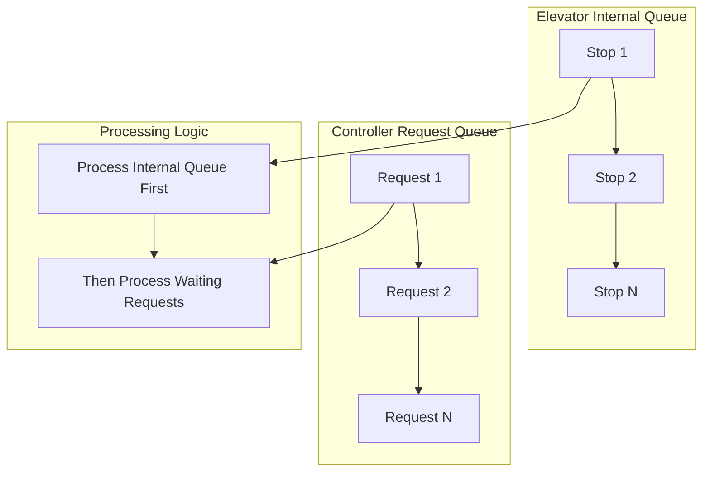

## Building System Integration

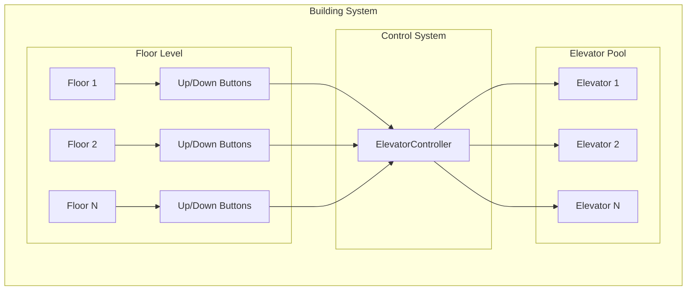

## Optimization Strategies

### 1. Direction-Based Optimization
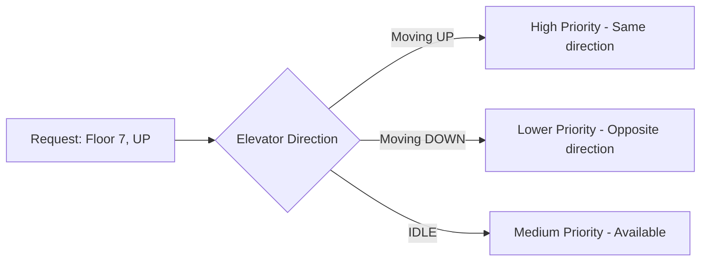

### 2. Load Balancing
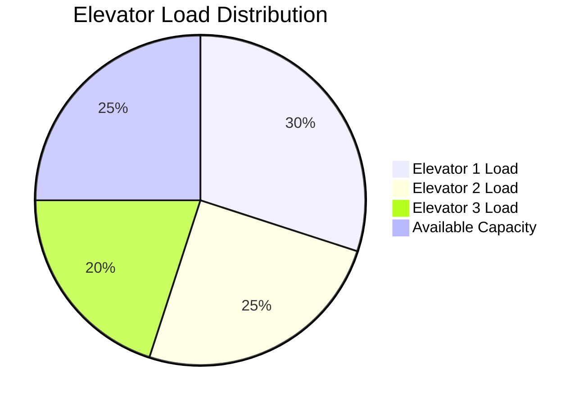

## Advanced Features Implementation

### 1. Priority Requests (VIP, Emergency)
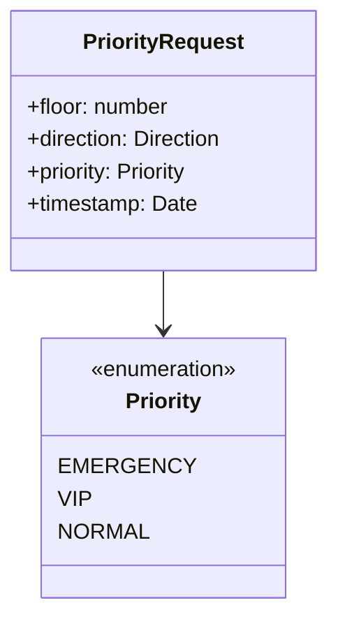

### 2. Energy Optimization
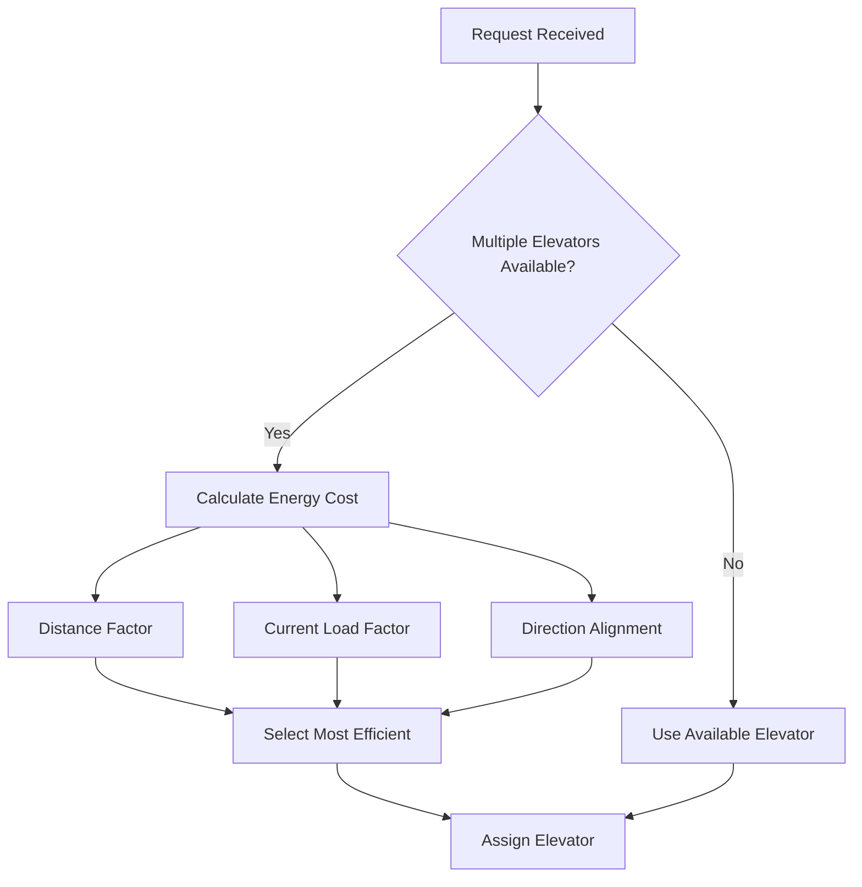

## Error Handling and Recovery

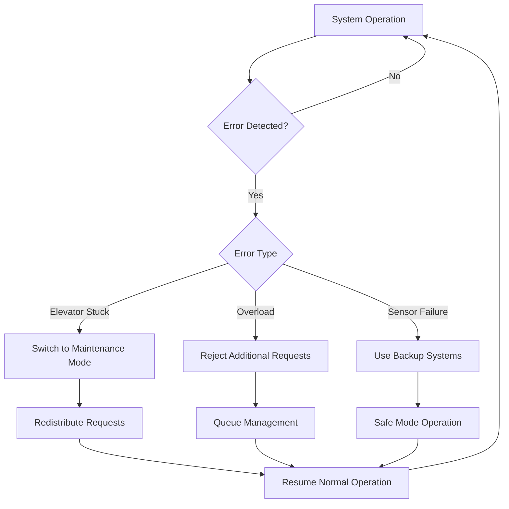

## Performance Metrics Dashboard

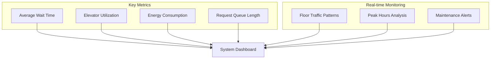

## Scalability Considerations

### 1. Multi-Building Support
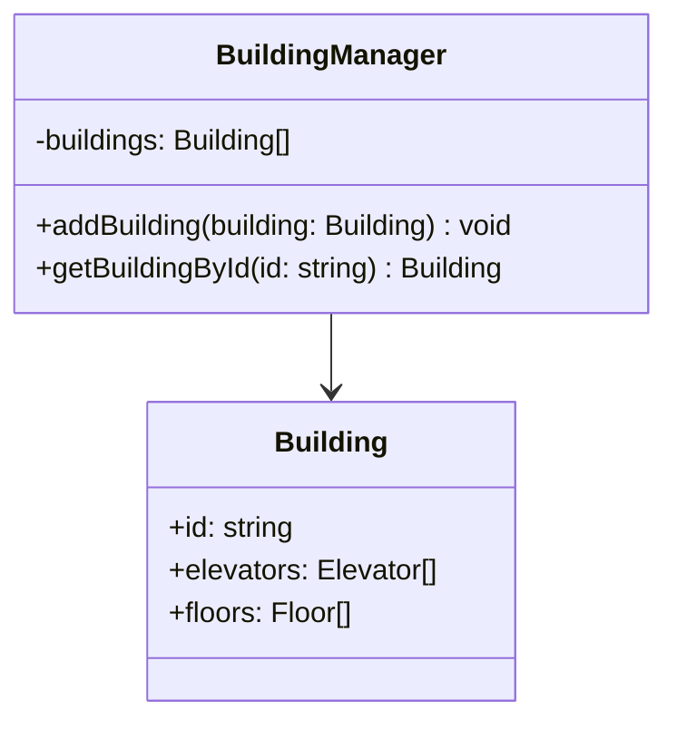

### 2. Distributed System Architecture
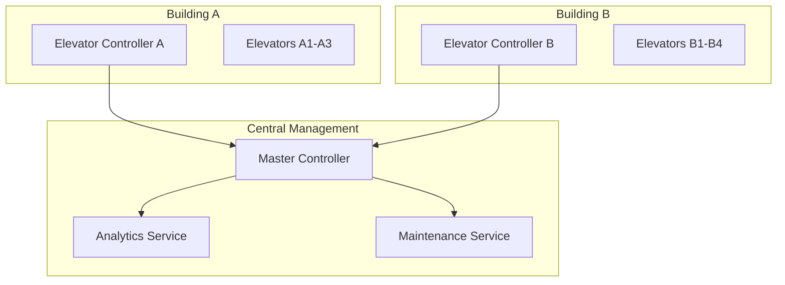

## Testing Strategy

### 1. Unit Tests
- Individual elevator movement logic
- Request queue management
- Button press handling
- State transitions

### 2. Integration Tests
- End-to-end request processing
- Multiple elevator coordination
- Load balancing verification

### 3. Load Tests
- Peak hour simulation
- Stress testing with multiple concurrent requests
- Performance under high load

## Key Features

### 1. **Intelligent Dispatching**
- Nearest elevator assignment
- Direction-based optimization
- Load balancing across elevators

### 2. **Queue Management**
- Priority-based request handling
- Efficient stop sorting
- Request queuing for busy periods

### 3. **State Management**
- Clear elevator state transitions
- Direction tracking
- Status monitoring

### 4. **Scalable Architecture**
- Multiple building support
- Configurable elevator count
- Flexible floor configuration

## Performance Characteristics

- **Request Processing**: O(n) where n = number of elevators
- **Stop Queue Management**: O(log n) for sorted insertion
- **Elevator Assignment**: O(n) for distance calculation
- **Memory Usage**: O(f + e + r) where f=floors, e=elevators, r=requests

This design provides a robust, scalable elevator system that can efficiently handle multiple requests while optimizing for user experience and energy efficiency.