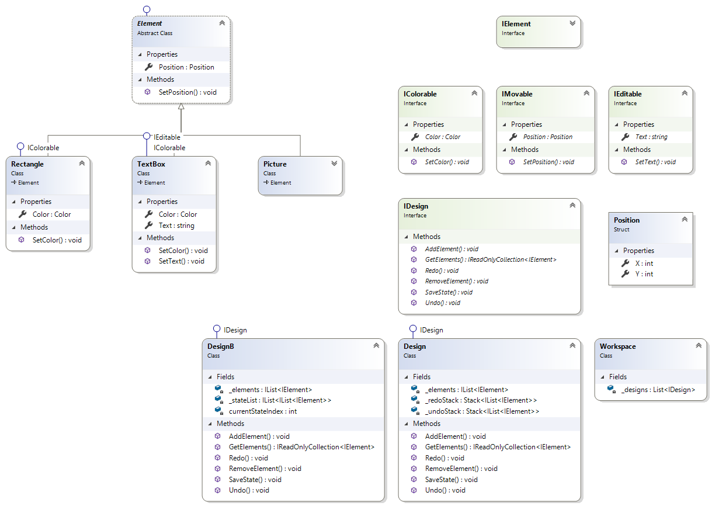

### Problem 5 (LLD):

At Vistaprint, we allow users to create their own designs. In designer, users can create their own designs by arranging different graphical elements. Elements can be created and deleted; they can be manipulated in different ways.

* Supported elements:
    * Picture
    * Text box
    * Rectangle

* Supported operations:
    * Insert a new element
    * Delete existing element
    * Any element: move
    * Text box, rectangle: change color
    * Text box: change text

In order to allow pleasant user experience, we need to support **undo and redo** for all supported operations.

* Your task is to:
    * Design an OO solution. Outline essential objects and data involved.
    * Describe interactions between the objects; describe the state of the system.
    * Run through simple scenarios to verify the design.

**Example scenarios**

* Pre
    * Insert a text box
    * Move the text box

* Scenario A
    * Undo

* Scenario B
    * Delete the text box
    * Undo
    * Redo

* Scenario C
    * Undo
    * Redo
    * Insert a rectangle
    * Undo

* Scenario D
    * Undo
    * Insert a rectangle
    * Move the rectangle
    * Undo

* Script extensions
    * Support multi-selection.
    * Support persistence.

* Scenarios for script extensions
    * Undo deletion of multiple selected elements.
    * Undo an operation after the design has been saved and restored from storage.

* Scenarios for script extensions for experienced candidates
    * Support changes made by help desk personnel on behalf of the user simultaneously to the changes made by the user.

#### Solution:
 
