# Graphic Designer Application - LLD Solution (Refactored)

## Problem Overview
Design a graphic designer application that allows users to create, manipulate, and arrange different graphical elements (Picture, TextBox, Rectangle) with full undo/redo functionality for all operations.

## 🔄 Architectural Refactoring Summary

This solution has been refactored to improve architecture and support multi-document workflows:

### ✅ What Changed
| **Before** | **After** | **Benefits** |
|------------|-----------|--------------|
| `Editor` + `CommandManager` | `Design` (merged) | Simplified architecture, reduced object interactions |
| Single editor instance | `Workspace` with `designs: Design[]` | Multi-document support, better organization |
| Delegated command management | Integrated command handling | Better encapsulation, improved performance |
| Generic "Editor" naming | Semantic "Design" naming | Clearer domain modeling |

### 🏗️ New Class Structure
```typescript
class Workspace {
    public designs: Design[] = [];  // Multiple design documents
}

class Design {  // Formerly Editor
    private elements: Map<string, DesignElement> = new Map();
    private undoStack: Command[] = [];  // Integrated command management
    private redoStack: Command[] = [];  // No separate CommandManager needed
}
```

## Refactored Solution Approach

This solution implements several key design patterns with an improved architecture:

1. **Command Pattern**: For undo/redo functionality
2. **Prototype Pattern**: For cloning design elements  
3. **Template Method Pattern**: Base DesignElement with abstract methods
4. **Memento Pattern**: State preservation for undo operations
5. **Factory Pattern**: Could be added for element creation

### Key Architectural Changes
- **Merged CommandManager into Design**: Eliminated separate CommandManager class by integrating command management directly into the Design class
- **Renamed Editor to Design**: Better semantic meaning - each Design represents a canvas/design document
- **Added Workspace Class**: Container for multiple Design instances, supporting multi-document workflows
- **Independent Design Operations**: Each Design maintains its own undo/redo stack and element collection

## Complete System Architecture

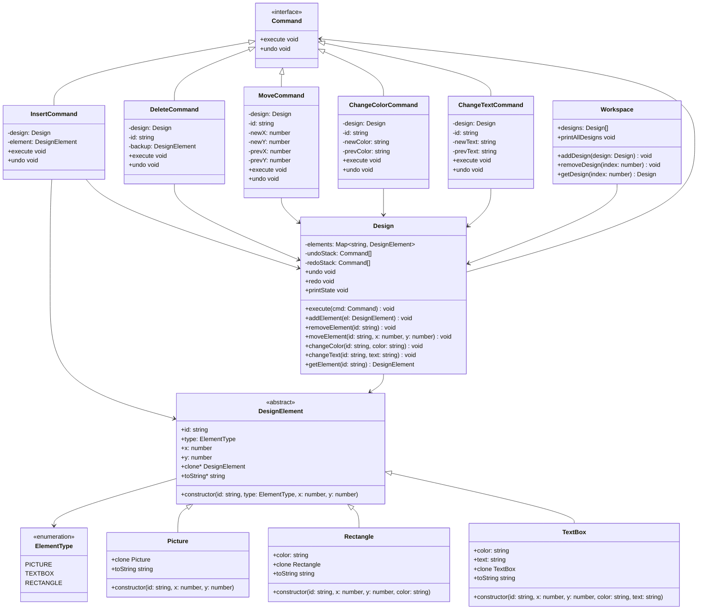

## Command Pattern Implementation (Refactored)

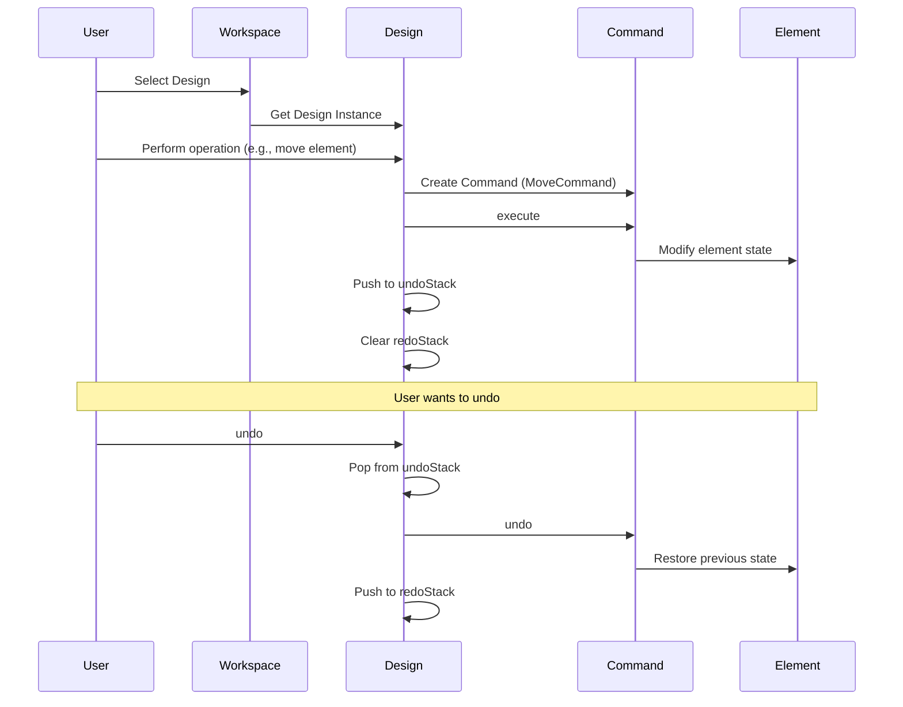

## Undo/Redo State Management

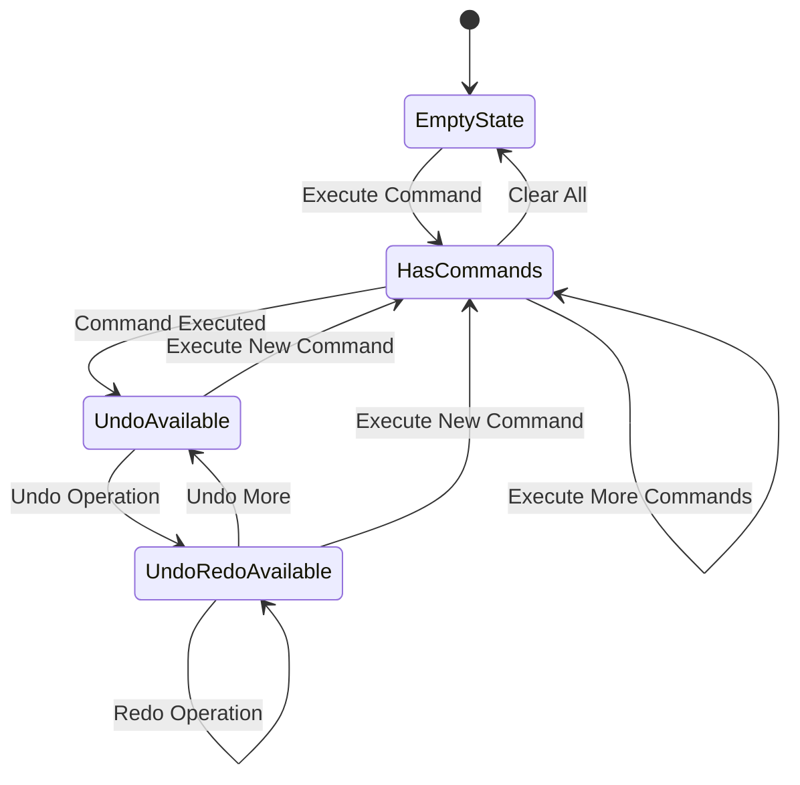

## Element Lifecycle Management

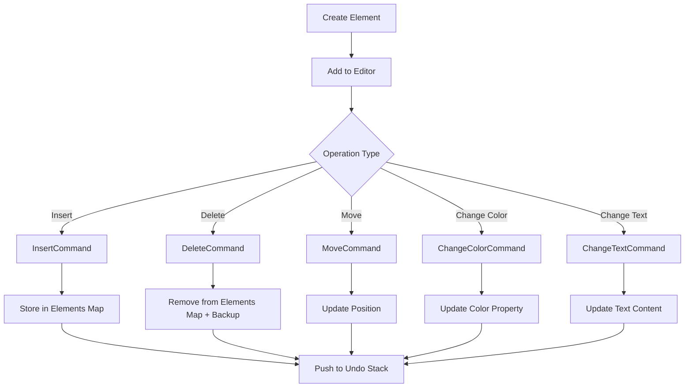

## Design Element Hierarchy

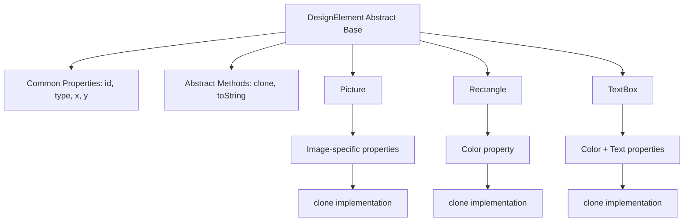

## Workspace Architecture

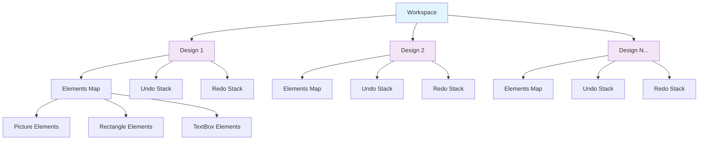

### Multi-Design Management Benefits
- **Independent Operation Histories**: Each design maintains its own undo/redo stack
- **Parallel Editing**: Multiple designs can be worked on simultaneously
- **Resource Isolation**: Changes in one design don't affect others
- **Scalable Architecture**: Easy to add/remove designs from workspace

### Example Usage
```typescript
// Create workspace
const workspace = new Workspace();

// Create multiple designs
const logo = new Design();
const banner = new Design();

// Add elements to different designs
logo.execute(new InsertCommand(logo, new Picture("logo1", 0, 0)));
banner.execute(new InsertCommand(banner, new TextBox("title", 10, 10, "blue", "Welcome")));

// Add designs to workspace
workspace.addDesign(logo);
workspace.addDesign(banner);

// Independent undo operations
logo.undo();    // Only affects logo design
banner.undo();  // Only affects banner design

// View all designs
workspace.printAllDesigns();
```

## Design Operations Flow (Refactored)

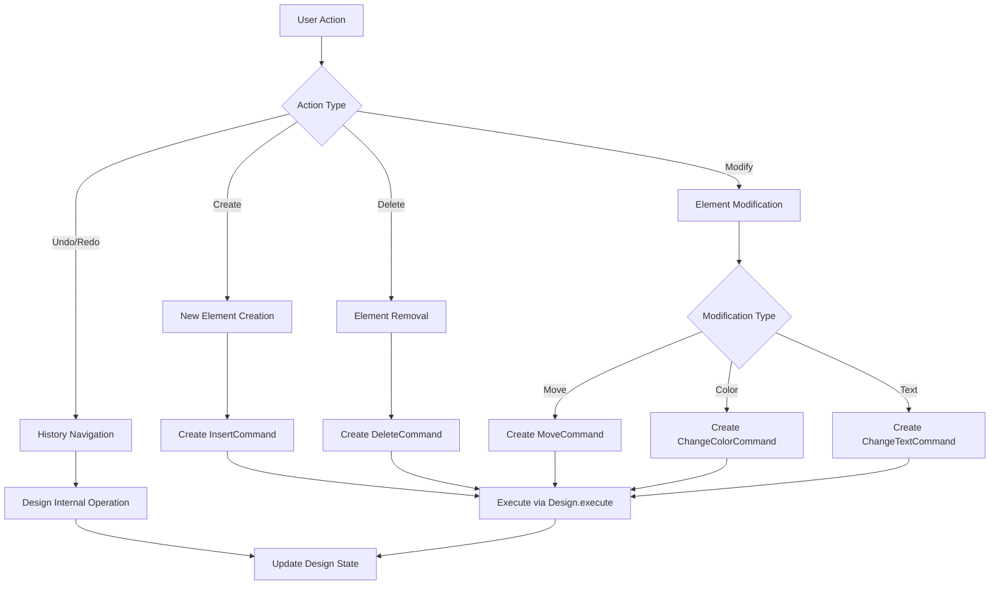

## State Preservation Strategy

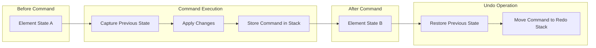

## Memory Management for Undo/Redo

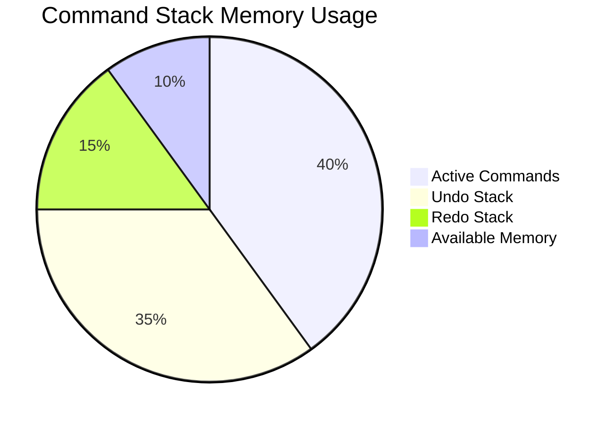

## Element Cloning Strategy (Prototype Pattern)

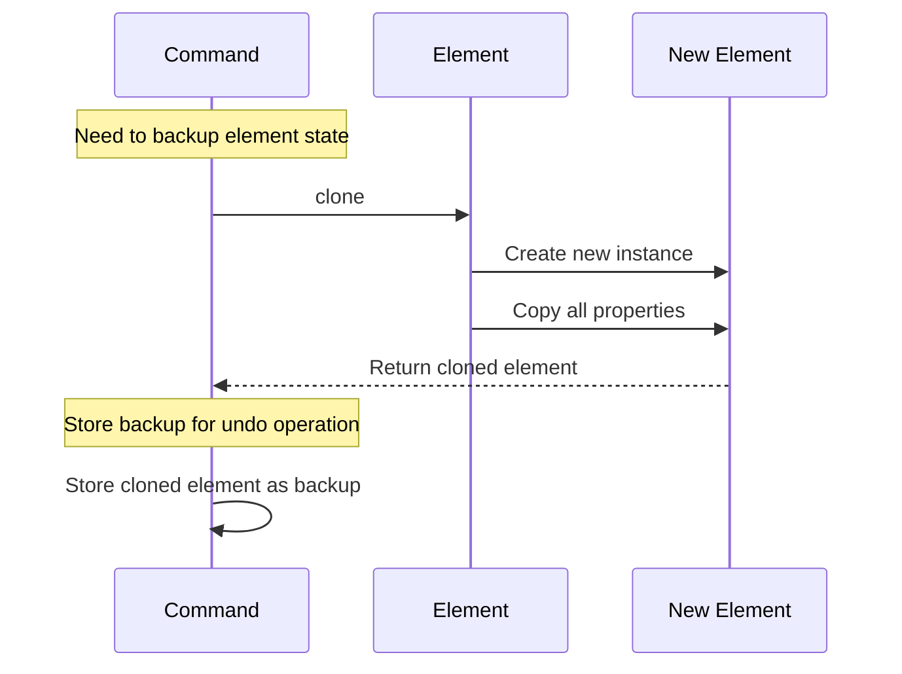

## Scenario Walkthrough: Complete User Interaction

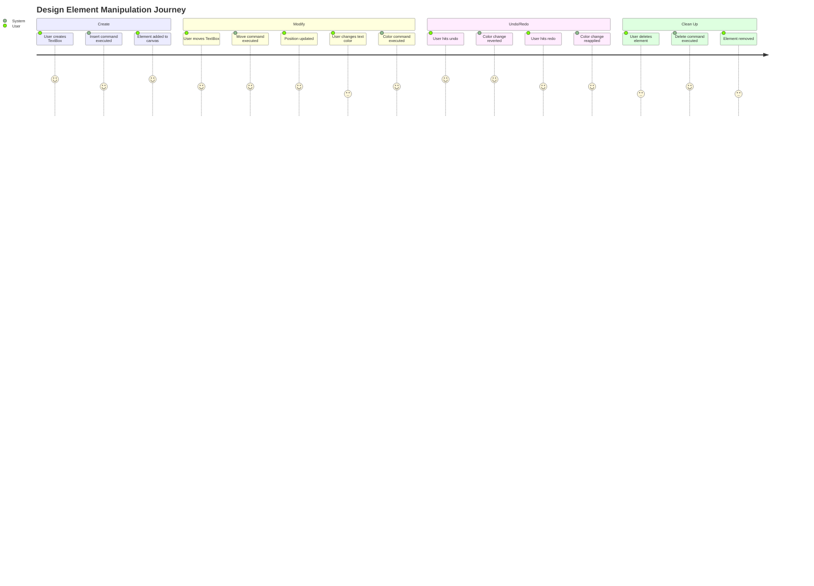

## Error Handling and Validation

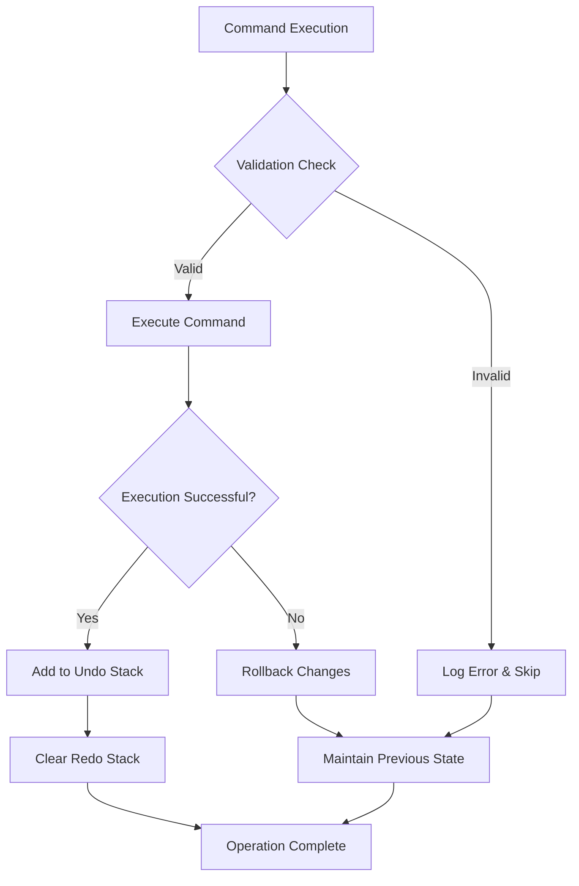

## Performance Optimization Strategies

### 1. Command Batching
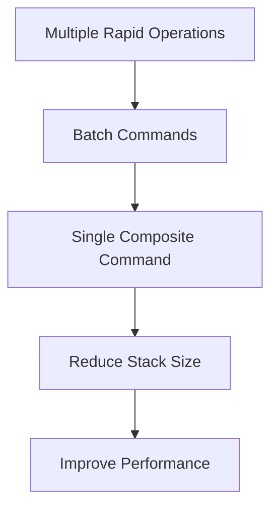

### 2. Memory Limit Management
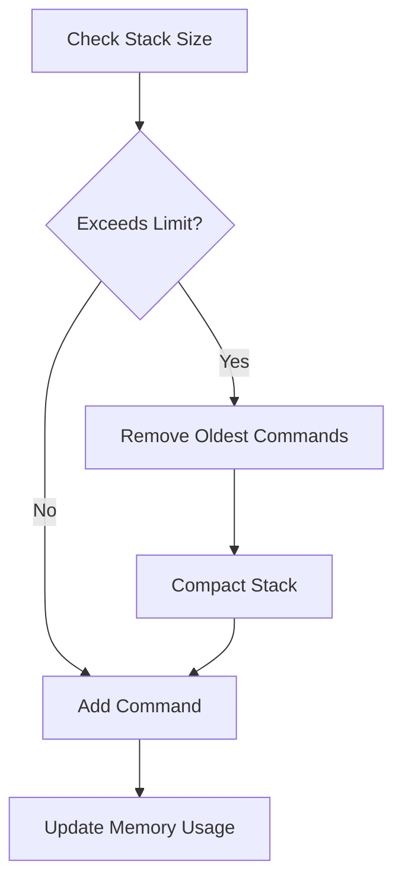

## Extensibility Features

### 1. New Element Types
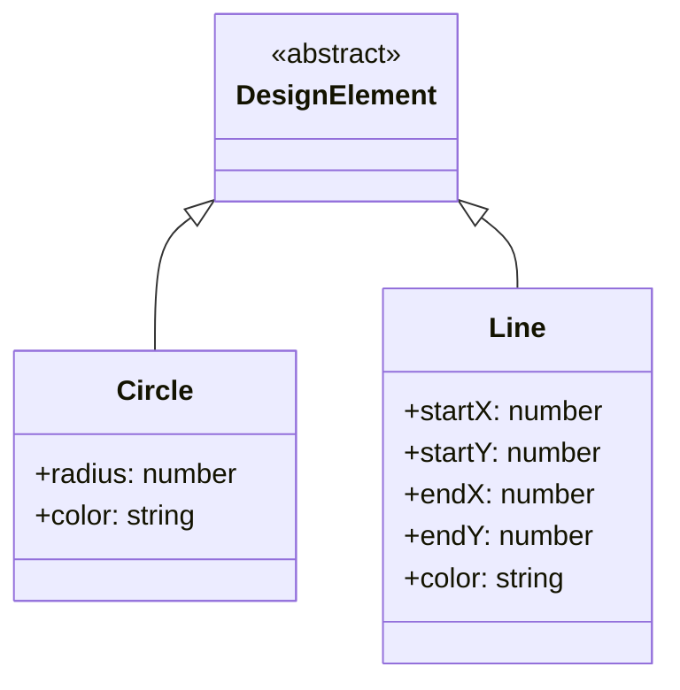

### 2. Complex Operations
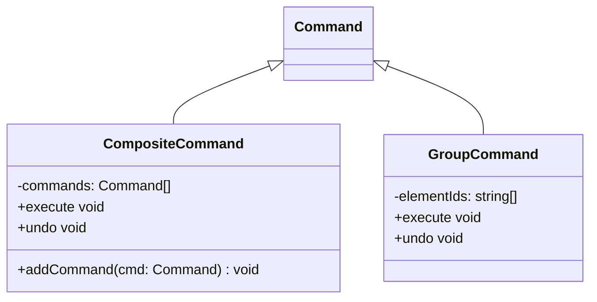

## Refactored Architecture Benefits

### 1. **Simplified Command Management**
- **Before**: Separate `CommandManager` class with delegation pattern
- **After**: Integrated command management directly into `Design` class
- **Benefit**: Reduced complexity, fewer object interactions, better encapsulation

### 2. **Enhanced Multi-Document Support**
- **New Feature**: `Workspace` class managing multiple `Design` instances
- **Benefit**: Support for multiple concurrent design documents
- **Use Case**: Users can work on multiple projects simultaneously

### 3. **Independent Design Operations**
- **Architecture**: Each `Design` maintains its own undo/redo stacks
- **Benefit**: Operations in one design don't affect others
- **Memory**: Isolated command histories prevent cross-design interference

### 4. **Improved Semantic Clarity**
- **Naming**: `Editor` → `Design` better represents individual design documents
- **Structure**: `Workspace.designs: Design[]` clearly expresses the relationship
- **API**: More intuitive method calls and class responsibilities

### 5. **Better Scalability**
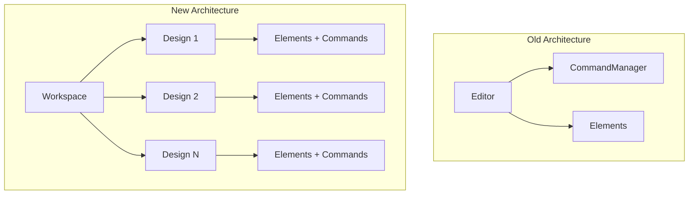

## Key Features

### 1. **Full Undo/Redo Support**
- Command pattern ensures every operation is reversible
- Separate undo and redo stacks maintain operation history
- State preservation through element cloning

### 2. **Extensible Element System**
- Abstract base class allows easy addition of new element types
- Prototype pattern enables deep copying of complex elements
- Type-safe operations through inheritance hierarchy

### 3. **Integrated Command Management**
- Each operation encapsulated as a command object
- Direct command management within Design class (no separate CommandManager)
- Consistent execute/undo interface across all operations
- Automatic redo stack clearing on new operations

### 4. **Multi-Design Workspace**
- Support for multiple concurrent design documents
- Independent undo/redo stacks per design
- Workspace-level design management operations
- Isolated element collections per design

### 5. **Memory Efficient Design**
- Elements stored in efficient Map structure per design
- Minimal memory overhead for command storage
- Lazy evaluation of backup states
- Independent memory management per design instance

## Performance Characteristics

### Single Design Operations
- **Element Access**: O(1) with Map-based storage per design
- **Command Execution**: O(1) for single operations
- **Undo/Redo**: O(1) stack operations per design
- **Memory Usage per Design**: O(n + c) where n = elements, c = command history

### Workspace Operations  
- **Design Access**: O(1) array-based access to designs
- **Multi-Design Memory**: O(d × (n + c)) where d = number of designs
- **Design Isolation**: Independent performance per design instance
- **Scalability**: Linear scaling with number of designs

### Architecture Benefits
- **Reduced Object Creation**: Eliminated CommandManager delegation overhead
- **Better Cache Locality**: Commands and elements co-located in Design class  
- **Independent Scaling**: Each design's performance is isolated
- **Memory Efficiency**: No shared state between designs reduces contention

This refactored design provides a robust foundation for a multi-document graphic design application with professional-grade undo/redo functionality, improved performance characteristics, and enhanced scalability for concurrent design workflows.