# Graphic Designer Application - LLD Solution

## Problem Overview
Design a graphic designer application that allows users to create, manipulate, and arrange different graphical elements (Picture, TextBox, Rectangle) with full undo/redo functionality for all operations.

## Solution Approach

This solution implements several key design patterns to create a robust, extensible graphic design system:

1. **Command Pattern**: For undo/redo functionality
2. **Prototype Pattern**: For cloning design elements  
3. **Template Method Pattern**: Base DesignElement with abstract methods
4. **Memento Pattern**: State preservation for undo operations
5. **Factory Pattern**: Could be added for element creation

## Complete System Architecture

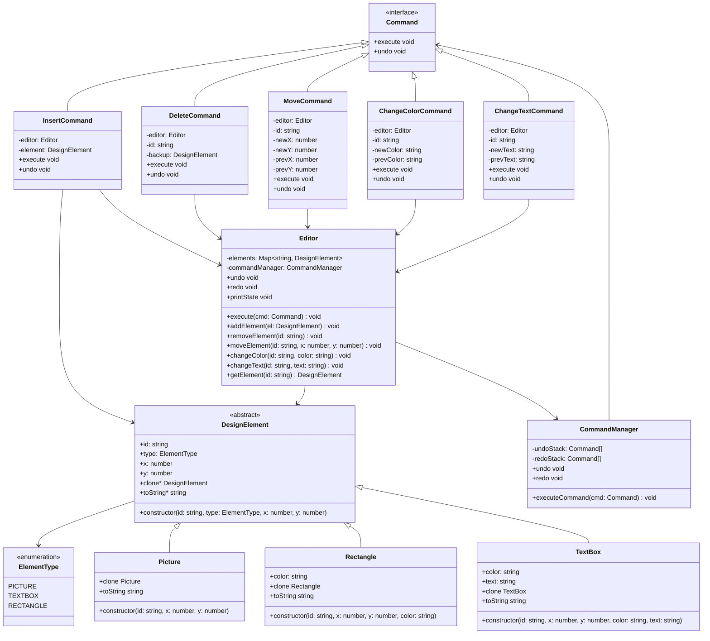

## Command Pattern Implementation

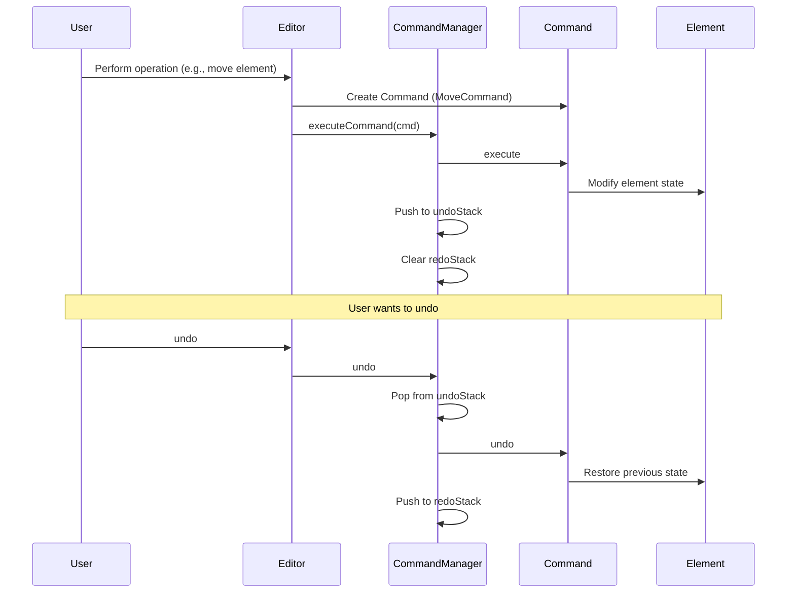

## Undo/Redo State Management

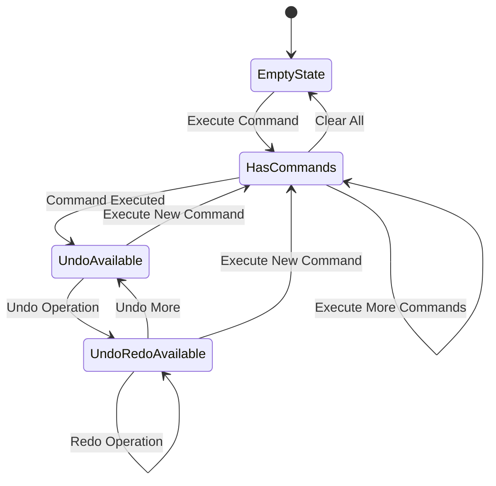

## Element Lifecycle Management

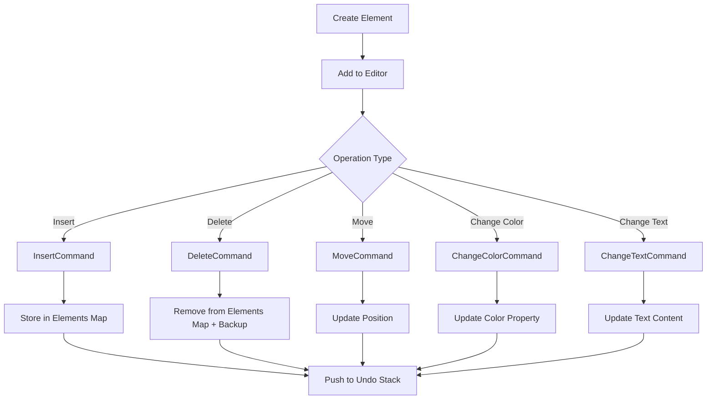

## Design Element Hierarchy

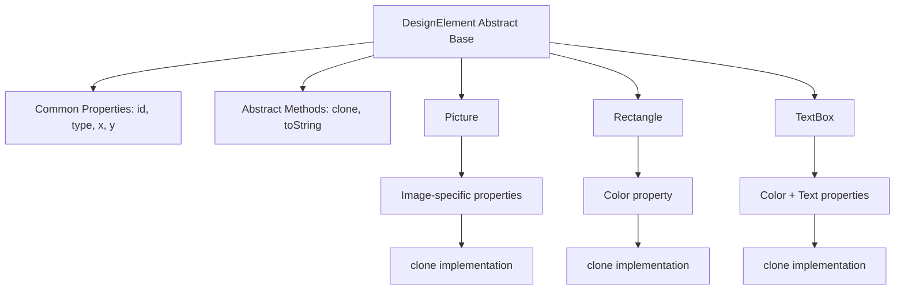

## Editor Operations Flow

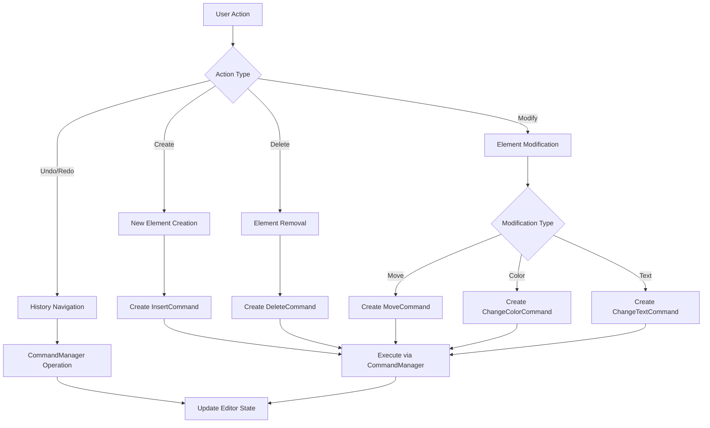

## State Preservation Strategy

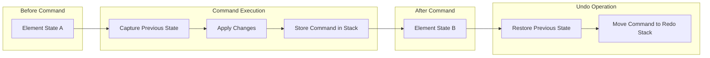

## Memory Management for Undo/Redo

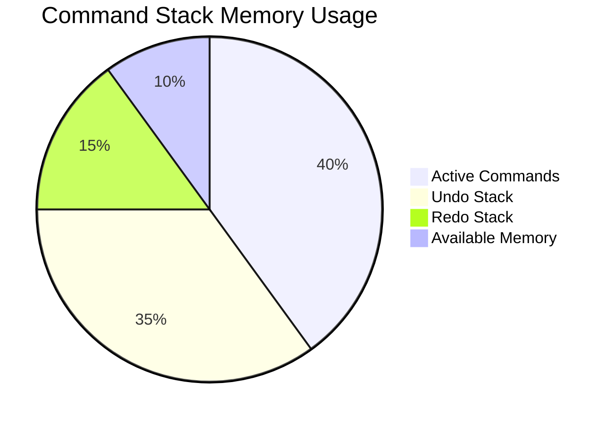

## Element Cloning Strategy (Prototype Pattern)

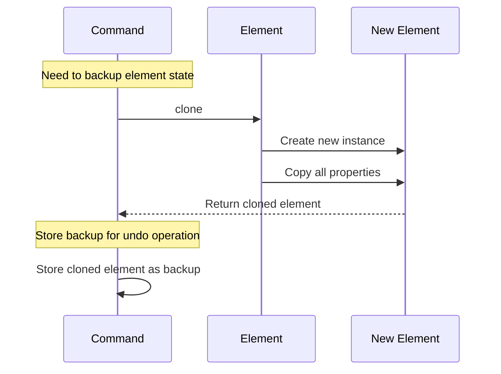

## Scenario Walkthrough: Complete User Interaction

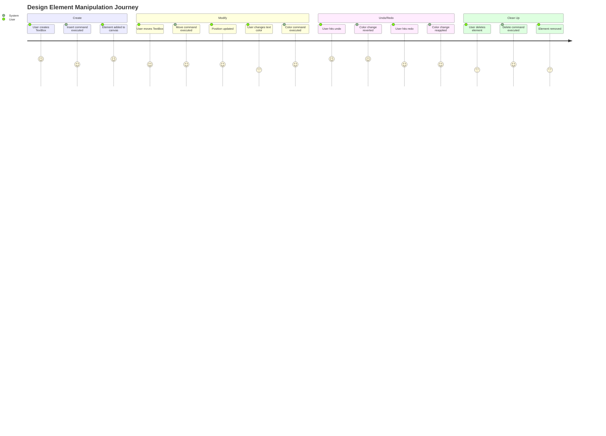

## Error Handling and Validation

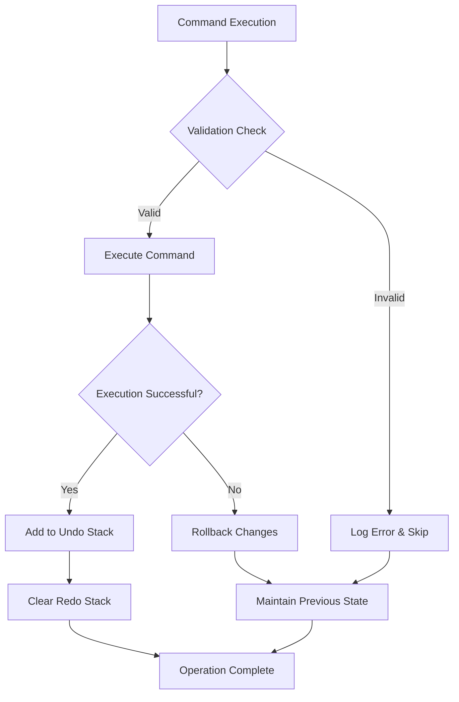

## Performance Optimization Strategies

### 1. Command Batching
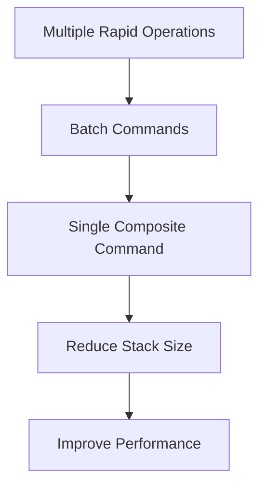

### 2. Memory Limit Management
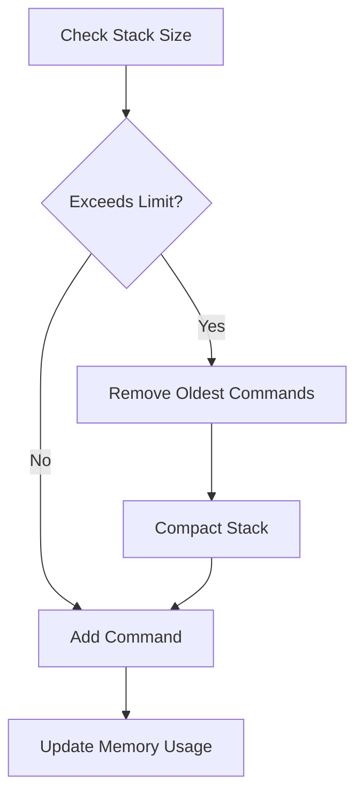

## Extensibility Features

### 1. New Element Types
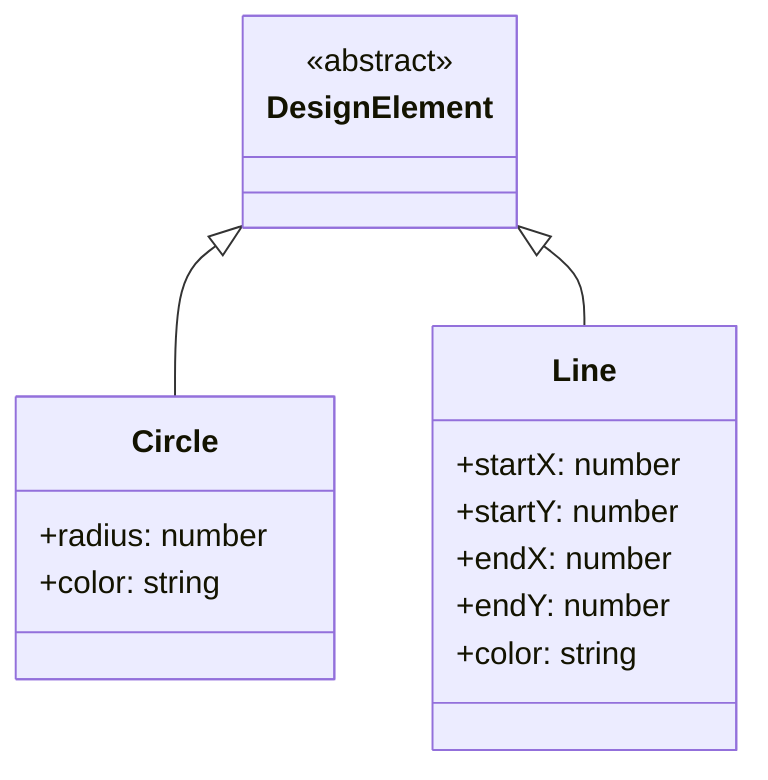

### 2. Complex Operations
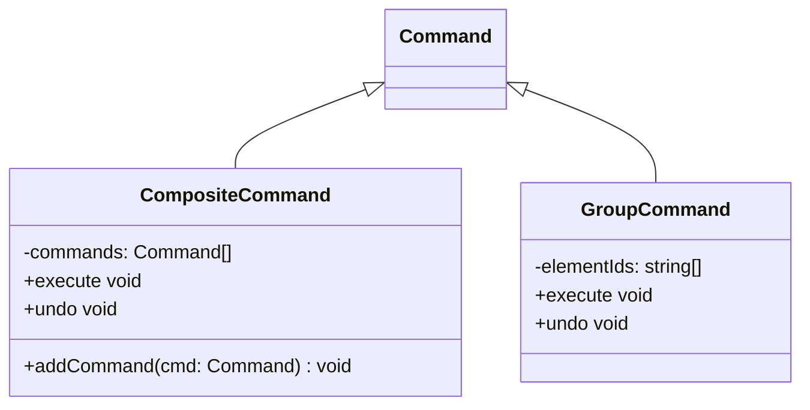

## Key Features

### 1. **Full Undo/Redo Support**
- Command pattern ensures every operation is reversible
- Separate undo and redo stacks maintain operation history
- State preservation through element cloning

### 2. **Extensible Element System**
- Abstract base class allows easy addition of new element types
- Prototype pattern enables deep copying of complex elements
- Type-safe operations through inheritance hierarchy

### 3. **Robust Command Management**
- Each operation encapsulated as a command object
- Consistent execute/undo interface across all operations
- Automatic redo stack clearing on new operations

### 4. **Memory Efficient Design**
- Elements stored in efficient Map structure
- Minimal memory overhead for command storage
- Lazy evaluation of backup states

## Performance Characteristics

- **Element Access**: O(1) with Map-based storage
- **Command Execution**: O(1) for single operations
- **Undo/Redo**: O(1) stack operations
- **Memory Usage**: O(n + c) where n = elements, c = command history

This design provides a solid foundation for a graphic design application with professional-grade undo/redo functionality while maintaining clean separation of concerns and extensibility.