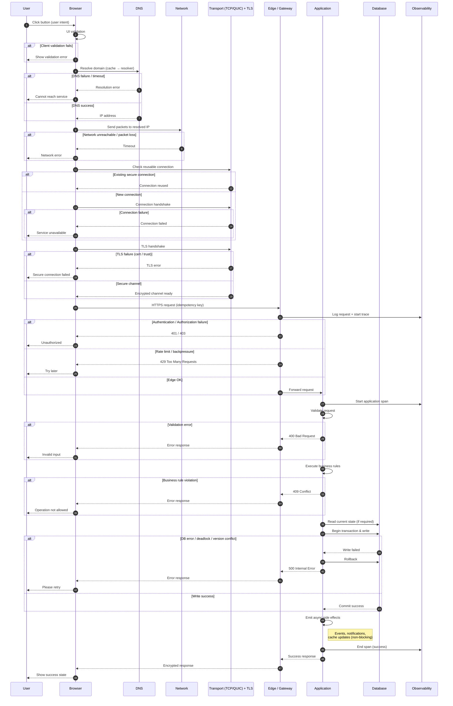

# UI to DB flow

Below is a detailed sequence diagram illustrating the flow of a user action from the UI layer down to the database and back, including error handling at various stages.

```mermaid

sequenceDiagram
    autonumber

    participant User
    participant Browser
    participant DNS
    participant Network
    participant Transport_TLS as Transport (TCP/QUIC) + TLS
    participant Edge as Edge / Gateway
    participant App as Application
    participant DB as Database
    participant Obs as Observability

    User->>Browser: Click button (user intent)
    Browser->>Browser: UI validation
    alt Client validation fails
        Browser-->>User: Show validation error
    end

    Browser->>DNS: Resolve domain (cache → resolver)
    alt DNS failure / timeout
        DNS-->>Browser: Resolution error
        Browser-->>User: Cannot reach service
    else DNS success
        DNS-->>Browser: IP address
    end

    Browser->>Network: Send packets to resolved IP
    alt Network unreachable / packet loss
        Network-->>Browser: Timeout
        Browser-->>User: Network error
    end

    Browser->>Transport_TLS: Check reusable connection
    alt Existing secure connection
        Transport_TLS-->>Browser: Connection reused
    else New connection
        Browser->>Transport_TLS: Connection handshake
        alt Connection failure
            Transport_TLS-->>Browser: Connection failed
            Browser-->>User: Service unavailable
        end
    end

    Browser->>Transport_TLS: TLS handshake
    alt TLS failure (cert / trust)
        Transport_TLS-->>Browser: TLS error
        Browser-->>User: Secure connection failed
    else Secure channel
        Transport_TLS-->>Browser: Encrypted channel ready
    end

    Browser->>Edge: HTTPS request (idempotency key)
    Edge->>Obs: Log request + start trace

    alt Authentication / Authorization failure
        Edge-->>Browser: 401 / 403
        Browser-->>User: Unauthorized
    else Rate limit / backpressure
        Edge-->>Browser: 429 Too Many Requests
        Browser-->>User: Try later
    else Edge OK
        Edge->>App: Forward request
    end

    App->>Obs: Start application span
    App->>App: Validate request
    alt Validation error
        App-->>Edge: 400 Bad Request
        Edge-->>Browser: Error response
        Browser-->>User: Invalid input
    end

    App->>App: Execute business rules
    alt Business rule violation
        App-->>Edge: 409 Conflict
        Edge-->>Browser: Error response
        Browser-->>User: Operation not allowed
    end

    App->>DB: Read current state (if required)
    App->>DB: Begin transaction & write
    alt DB error / deadlock / version conflict
        DB-->>App: Write failed
        App->>DB: Rollback
        App-->>Edge: 500 Internal Error
        Edge-->>Browser: Error response
        Browser-->>User: Please retry
    else Write success
        DB-->>App: Commit success
    end

    App->>App: Emit async side effects
    note right of App: Events, notifications,<br/>cache updates (non-blocking)

    App->>Obs: End span (success)
    App-->>Edge: Success response
    Edge-->>Browser: Encrypted response
    Browser-->>User: Show success state


```
